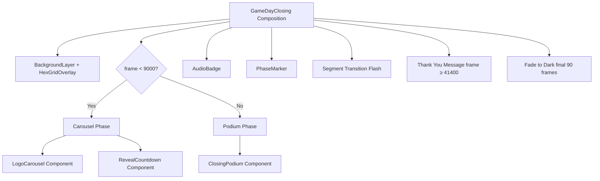

# Design Document: Closing Ceremony Redesign

## Overview

This design transforms the closing ceremony Remotion composition (`4-GameDayStreamClosing.tsx`) from a static countdown-plus-schedule layout into a two-phase cinematic flow:

1. **Carousel Phase** (frames 0–8999, 5 minutes): A logo carousel cycles all 48 participating user group logos through six numbered "slots" (1–6), building anticipation while hosts discuss results. A compact countdown timer shows time remaining until the reveal.
2. **Podium Phase** (frames 9000–12599): The existing `ClosingPodium` component animates in with spring transitions, revealing the top-6 example team results.

The composition retains its 1280×720 resolution at 30fps across 54000 frames (30 minutes). `AudioBadge` and `PhaseMarker` overlays remain throughout.

### Key Design Decisions

- **Import full LOGO_MAP from archive**: The 48-entry `LOGO_MAP` from `archive/CommunityGamedayEuropeV4.tsx` is imported directly rather than duplicated, keeping a single source of truth.
- **Slot-machine metaphor**: Six vertical columns each display a rank number (1–6) with logos cycling vertically behind/around them, evoking a slot machine that "hasn't stopped yet."
- **Phase gating via frame number**: Simple `frame < 9000` / `frame >= 9000` conditionals control which phase renders — no state machine needed for a deterministic Remotion composition.
- **Reuse existing components**: `ClosingPodium`, `TeamCard`, `AudioBadge`, `PhaseMarker`, `BackgroundLayer`, `HexGridOverlay` are all reused without modification.

## Architecture

The composition follows a layered rendering approach consistent with the existing design system:



### Rendering Layers (z-index order)

| Layer | z-index | Component | Frames |
|-------|---------|-----------|--------|
| Background | 0 | `BackgroundLayer` + `HexGridOverlay` | 0–53999 |
| Carousel | 5 | `LogoCarousel` | 0–8999 |
| Reveal Countdown | 10 | `RevealCountdown` | 0–8999 |
| Podium | 10 | `ClosingPodium` | 9000–12599 |
| AudioBadge | 50 | `AudioBadge` | 0–53999 |
| PhaseMarker | 50 | `PhaseMarker` | 0–53999 |
| Segment Flash | 200 | Transition overlay | On segment boundaries |
| Thank You | 100 | Thank You message | 41400–53999 |
| Fade to Dark | 300 | Black overlay | 53910–53999 |

### What Gets Removed

- **Big Timer** (Layer 4 in current code): The "Event Ends In" label + 110px countdown at top-left. The `eventCountdown` calculation and `timerEntry` spring are also removed.
- **Schedule Sidebar** (Layer 5 in current code): The right-side 42%-width panel with `ScheduleCard` components. The `sidebarEntry` spring is also removed. The `ScheduleCard` component itself can remain in the file (unused) or be removed — it is no longer rendered.
- **`CLOSING_SEGMENTS` array**: Retained for `PhaseMarker` usage.

## Components and Interfaces

### New Components

#### `LogoCarousel`

```typescript
interface LogoCarouselProps {
  frame: number;
  fps: number;
}
```

Renders six vertical "slot" columns, each labeled with a rank number (1–6). Each column cycles through a subset of the 48 user group logos with a continuous vertical scroll animation.

**Logo Distribution**: The 48 logos are divided into 6 groups of 8 logos each (48 / 6 = 8). Each slot column cycles through its assigned 8 logos. The logos are distributed by taking every 6th logo from the sorted array, so slot 1 gets indices 0, 6, 12, 18, 24, 30, 36, 42; slot 2 gets indices 1, 7, 13, etc. This ensures geographic/alphabetical diversity within each column.

**Animation Mechanics**:
- Each column renders a vertical strip of circular logo images (64×64px) with group names below.
- The strip scrolls vertically using `translateY` driven by `interpolate(frame, [0, 9000], [0, -totalHeight])` with `extrapolateRight: 'clamp'`.
- Each column has a slightly different scroll speed (offset by ±5–10%) to create visual variety and avoid a mechanical feel.
- The strip is duplicated (logos repeated) so the scroll appears infinite within the 5-minute window.
- A CSS `overflow: hidden` mask on each column clips the logos to a visible window.

**Layout**: Six columns are arranged horizontally across the viewport center, each approximately 180px wide with 16px gaps. The rank number (1–6) is displayed prominently (48px, bold, gold color) at the center of each column, with logos scrolling behind it with reduced opacity (0.6) so the number remains readable.

#### `RevealCountdown`

```typescript
interface RevealCountdownProps {
  frame: number;
  fps: number;
}
```

A compact countdown timer positioned at the top-center of the viewport. Displays "RESULTS IN" label above a `MM:SS` time display. Uses `formatTime((9000 - frame) / fps)` for the countdown value.

**Styling**: 
- Label: 14px, uppercase, letter-spacing 3, `GD_GOLD` color
- Time: 36px, bold, white, monospace — significantly smaller than the removed 110px Big Timer
- Wrapped in a `GlassCard` with compact padding for visual consistency
- Positioned at `top: 24px`, centered horizontally, `z-index: 10`

### Modified Components

#### `ClosingPodium` (modification)

The existing `ClosingPodium` component is modified to accept a `startFrame` prop (default: 0) so it can delay its appearance until frame 9000. The component already returns `null` when `frame >= 12600`, so it naturally hides after the Winner Announcement segment.

```typescript
// Before: always renders from frame 0
const ClosingPodium: React.FC<{ frame: number; fps: number }>

// After: renders only when frame >= startFrame
const ClosingPodium: React.FC<{ frame: number; fps: number; startFrame?: number }>
```

Inside the component, a guard is added: `if (frame < (startFrame ?? 0)) return null;`

The `revealFrame` values passed to each `TeamCard` are adjusted relative to `startFrame` (e.g., rank 6 reveals at `startFrame + 0`, rank 1 reveals at `startFrame + 1500`).

#### `GameDayClosing` (modification)

The main composition is restructured:
1. Remove the Big Timer JSX block (Layer 4) and its `timerEntry` / `eventCountdown` variables
2. Remove the Schedule Sidebar JSX block (Layer 5) and its `sidebarEntry` variable
3. Add `LogoCarousel` rendering conditionally when `frame < 9000`
4. Add `RevealCountdown` rendering conditionally when `frame < 9000`
5. Pass `startFrame={9000}` to `ClosingPodium`

### Unchanged Components

- `TeamCard` — no changes needed
- `AudioBadge` — remains at bottom-right with `muted={false}`
- `PhaseMarker` — remains at bottom-left using `CLOSING_SEGMENTS`
- `BackgroundLayer` + `HexGridOverlay` — unchanged
- Thank You message — unchanged (frame ≥ 41400)
- Fade to dark — unchanged (frames 53910–53999)
- Segment transition flash — unchanged

## Data Models

### Imported Data

```typescript
// From archive/CommunityGamedayEuropeV4.tsx
import { LOGO_MAP as FULL_LOGO_MAP } from './archive/CommunityGamedayEuropeV4.tsx';
```

The full `LOGO_MAP` (48 entries) is imported for the carousel. The existing 6-entry `LOGO_MAP` in the closing file is kept for `PODIUM_TEAMS` usage (or replaced by referencing the full map).

### Logo Group Assignment

```typescript
// Distribute 48 logos into 6 groups of 8
const logoEntries = Object.entries(FULL_LOGO_MAP); // 48 entries
const CAROUSEL_GROUPS: Array<Array<[string, string]>> = Array.from(
  { length: 6 },
  (_, slotIndex) => logoEntries.filter((_, i) => i % 6 === slotIndex)
);
```

### Constants

```typescript
const CAROUSEL_END_FRAME = 9000;  // 5 minutes at 30fps
const PODIUM_START_FRAME = 9000;  // Podium appears when carousel ends
const SLOT_COUNT = 6;
const LOGOS_PER_SLOT = 8;         // 48 / 6
```

### Existing Data (Retained)

- `CLOSING_SEGMENTS: ScheduleSegment[]` — retained for `PhaseMarker`
- `PODIUM_TEAMS: TeamData[]` — retained for `ClosingPodium`
- `LOGO_MAP` (6-entry) — can be kept or derived from `FULL_LOGO_MAP`

## Correctness Properties

*A property is a characteristic or behavior that should hold true across all valid executions of a system — essentially, a formal statement about what the system should do. Properties serve as the bridge between human-readable specifications and machine-verifiable correctness guarantees.*

### Property 1: Big Timer is absent

*For any* frame in [0, 53999], the rendered composition output shall not contain the "Event Ends In" text or a large-format countdown timer element in the top-left region.

**Validates: Requirements 1.1, 1.2**

### Property 2: Schedule Sidebar is absent

*For any* frame in [0, 53999], the rendered composition output shall not contain a right-side panel with "Closing Ceremony" heading or `ScheduleCard` segment list elements.

**Validates: Requirements 2.1, 2.2**

### Property 3: Phase gating — carousel/countdown vs podium

*For any* frame in [0, 53999]:
- If `frame < 9000`, the Logo Carousel and Reveal Countdown shall be visible, and the Podium shall not be visible.
- If `9000 <= frame < 12600`, the Podium shall be visible, and the Logo Carousel and Reveal Countdown shall not be visible.
- If `frame >= 12600`, neither the Logo Carousel, Reveal Countdown, nor Podium shall be visible.

**Validates: Requirements 3.1, 3.6, 4.1, 4.4, 5.1, 5.4, 5.5**

### Property 4: Logo rendering completeness

*For any* logo entry in the full LOGO_MAP (48 entries), the Logo Carousel shall render that logo as a circular image element with the corresponding group name text visible at some point during the Carousel Phase.

**Validates: Requirements 3.2, 3.3, 3.5**

### Property 5: Countdown time accuracy

*For any* frame in [0, 8999], the Reveal Countdown shall display a time string equal to `formatTime(Math.floor((9000 - frame) / 30))`, counting down from "05:00" at frame 0 to "00:00" at frame 8970+.

**Validates: Requirements 4.2, 4.5**

### Property 6: Persistent overlays

*For any* frame in [0, 53999], both the AudioBadge (bottom-right, showing "AUDIO ON") and PhaseMarker (bottom-left) shall be visible in the rendered output.

**Validates: Requirements 6.1, 6.2, 7.1**

### Property 7: PhaseMarker segment accuracy

*For any* frame in [0, 53999], the PhaseMarker shall display the segment name from `CLOSING_SEGMENTS` whose `[startFrame, endFrame]` range contains the current frame, and the progress bar shall reflect `(frame - startFrame) / (endFrame - startFrame + 1)`.

**Validates: Requirements 7.2**

## Error Handling

### Missing Logo Images

If a logo URL from `FULL_LOGO_MAP` fails to load, the `` component from Remotion will throw during rendering. To handle this gracefully:
- Wrap each logo `` in an error boundary or use Remotion's `onError` prop (if available) to fall back to displaying the group name text with a flag emoji placeholder.
- Alternatively, since these are static URLs validated at build time, missing images can be caught during `npx remotion render` and fixed before production.

### Frame Boundary Edge Cases

- Frame 8999 → 9000 transition: The carousel/countdown hide and podium shows. No overlap because conditions are mutually exclusive (`frame < 9000` vs `frame >= 9000`).
- Frame 12599 → 12600: Podium hides (existing `ClosingPodium` returns `null` when `frame >= 12600`).
- Frame 53910–53999: Fade-to-dark overlay covers everything — no special handling needed.

### Empty Logo Map

If `FULL_LOGO_MAP` is somehow empty (0 entries), the carousel would render 6 empty columns. This is a data integrity issue caught at import time — the archive file has 48 hardcoded entries.

## Testing Strategy

### Property-Based Testing

Use `fast-check` as the property-based testing library (compatible with the project's TypeScript/React stack).

Each correctness property maps to a single property-based test with a minimum of 100 iterations. Tests generate random frame numbers within the composition range and verify the property holds.

**Tag format**: `Feature: closing-ceremony-redesign, Property {N}: {title}`

#### Test Plan

| Property | Generator | Assertion |
|----------|-----------|-----------|
| P1: Big Timer absent | Random frame ∈ [0, 53999] | No "Event Ends In" text in rendered output |
| P2: Sidebar absent | Random frame ∈ [0, 53999] | No "Closing Ceremony" sidebar heading in rendered output |
| P3: Phase gating | Random frame ∈ [0, 53999] | Carousel visible iff frame < 9000; Podium visible iff 9000 ≤ frame < 12600 |
| P4: Logo completeness | Random logo index ∈ [0, 47] | Logo name appears in carousel render at some frame |
| P5: Countdown accuracy | Random frame ∈ [0, 8999] | Displayed time equals `formatTime(Math.floor((9000 - frame) / 30))` |
| P6: Persistent overlays | Random frame ∈ [0, 53999] | AudioBadge and PhaseMarker present in rendered output |
| P7: Segment accuracy | Random frame ∈ [0, 53999] | PhaseMarker label matches expected segment from CLOSING_SEGMENTS |

### Unit Testing

Unit tests complement property tests by covering specific examples and edge cases:

- **Frame boundary tests**: Verify exact behavior at frames 0, 8999, 9000, 12599, 12600, 41400, 53910, 53999
- **Logo distribution**: Verify `CAROUSEL_GROUPS` produces 6 groups of 8 logos each with no duplicates
- **Countdown edge values**: Verify countdown shows "05:00" at frame 0 and "00:00" at frame 8970
- **CLOSING_SEGMENTS retention**: Verify the array is exported and has 7 segments with correct frame ranges
- **Podium reveal stagger**: Verify TeamCard reveal frames are offset correctly from `startFrame=9000`

### Testing Configuration

```typescript
// fast-check configuration
fc.assert(
  fc.property(
    fc.integer({ min: 0, max: 53999 }),
    (frame) => { /* property assertion */ }
  ),
  { numRuns: 100 }
);
```

Each property test file should reference its design property:
```typescript
// Feature: closing-ceremony-redesign, Property 3: Phase gating
```
