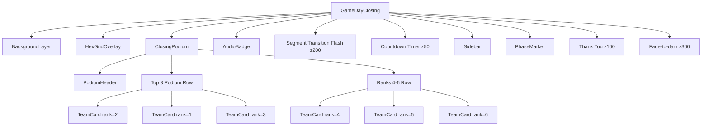

# Design Document: Closing Podium Ceremony

## Overview

The Closing Podium Ceremony adds an animated podium visualization to the `GameDayClosing` Remotion composition (`4-GameDayStreamClosing.tsx`). It displays the top 6 teams with placeholder data during the "Results Reveal" (frames 0–5399) and "Global Winner Announcement" (frames 5400–12599) segments. The podium uses a classic 2nd-1st-3rd layout for the top 3, with ranks 4–6 in a smaller row below. Teams are revealed one-by-one in reverse rank order using spring animations, matching the existing GameDay design system aesthetic.

The component is self-contained — a single `ClosingPodium` component inserted into the existing layer stack. It renders within the left 58% of the 1280×720 canvas, avoiding the sidebar, countdown, phase marker, and audio badge. It uses glass-card styling with GD_GOLD accents and disappears at frame 12600.

## Architecture

The podium is implemented as a single React component (`ClosingPodium`) that receives `frame` and `fps` props from the parent composition. It is inserted into the `GameDayClosing` render tree as a new layer between the HexGridOverlay and the sidebar.



### Layer Stack Integration

The `ClosingPodium` component uses a z-index that places it above the background layers but below all overlays:

| Layer | z-index | Notes |
|-------|---------|-------|
| BackgroundLayer + HexGridOverlay | — | Base layers |
| **ClosingPodium** | **10** | New — podium content |
| AudioBadge | 50 | Bottom-right |
| Countdown Timer | 50 | Top-left |
| Thank You | 100 | Frame 41400+ |
| Segment Transition Flash | 200 | Brief flash on segment change |
| Fade-to-dark | 300 | Final frames |

### Visibility Logic

- Frames 0–5399 (Results Reveal): Podium animates in, reveal sequence plays
- Frames 5400–12599 (Winner Announcement): Podium fully visible, static
- Frame 12600+: Podium hidden (not rendered)

This is achieved with a simple conditional: `if (frame >= 12600) return null`.

## Components and Interfaces

### ClosingPodium

The main container component. Renders within the left 58% of the screen.

```typescript
interface ClosingPodiumProps {
  frame: number;
  fps: number;
}
```

Responsibilities:
- Conditionally render based on frame (visible frames 0–12599)
- Position content within left 58% (max-width ~742px)
- Render PodiumHeader, top-3 podium row, and ranks 4–6 row
- Calculate per-card reveal timing using staggered spring animations

### TeamCard

A reusable card component for displaying a single team.

```typescript
interface TeamCardProps {
  team: TeamData;
  rank: number;
  frame: number;
  fps: number;
  revealFrame: number;  // frame at which this card starts animating in
  size: "large" | "small";  // large for top 3, small for ranks 4-6
}
```

Responsibilities:
- Display rank number, "TEAM" label, team name, score
- Show logo via `Img` (from remotion) or flag emoji fallback
- Apply glass-card styling with rank-appropriate border color
- Animate from opacity 0 + translateY offset to final position using spring

### PodiumHeader

A simple styled text element.

```typescript
// Inline within ClosingPodium — no separate props interface needed
// Renders: "🏆 PODIUM 🏆" in GD_GOLD, font-weight 900, letter-spacing 4px+
```

## Data Models

### TeamData

```typescript
interface TeamData {
  name: string;
  flag: string;
  city: string;
  score: number;
  logoUrl: string | null;  // null when no LOGO_MAP entry exists
}
```

### PODIUM_TEAMS constant

Six entries selected from USER_GROUPS/LOGO_MAP, with distinct descending scores:

```typescript
const PODIUM_TEAMS: TeamData[] = [
  { name: "AWS User Group Vienna", flag: "🇦🇹", city: "Vienna, Austria", score: 4850, logoUrl: LOGO_MAP["AWS User Group Vienna"] },
  { name: "Berlin AWS User Group", flag: "🇩🇪", city: "Berlin, Germany", score: 4720, logoUrl: LOGO_MAP["Berlin AWS User Group"] },
  { name: "AWS User Group France- Paris", flag: "🇫🇷", city: "Paris, France", score: 4580, logoUrl: LOGO_MAP["AWS User Group France- Paris"] },
  { name: "AWS User Group Finland", flag: "🇫🇮", city: "Helsinki, Finland", score: 4410, logoUrl: LOGO_MAP["AWS User Group Finland"] },
  { name: "AWS User Group Roma", flag: "🇮🇹", city: "Roma, Italy", score: 4250, logoUrl: LOGO_MAP["AWS User Group Roma"] },
  { name: "AWS User Group Warsaw", flag: "🇵🇱", city: "Warsaw, Poland", score: 4090, logoUrl: LOGO_MAP["AWS User Group Warsaw"] },
];
```

All 6 teams have entries in LOGO_MAP, so logos will display. Scores are distinct and descending (rank 1 = 4850, rank 6 = 4090).

### Reveal Timing

Teams reveal in reverse rank order (6th → 1st) with 300-frame (10s) stagger:

| Reveal Order | Rank | Start Frame |
|-------------|------|-------------|
| 1st reveal  | 6th  | 0           |
| 2nd reveal  | 5th  | 300         |
| 3rd reveal  | 4th  | 600         |
| 4th reveal  | 3rd  | 900         |
| 5th reveal  | 2nd  | 1200        |
| 6th reveal  | 1st  | 1500        |

With spring animations (~60–90 frames to settle), all cards are fully visible by ~frame 1590, well within the 5400-frame Results Reveal segment.

### Layout Dimensions

Working within the available podium area (x:0–742, y:~180–650):

- Podium header: top of area, centered, ~40px height
- Top 3 row: 3 cards arranged horizontally
  - 1st place (center): ~180px wide, ~220px tall (tallest)
  - 2nd place (left): ~160px wide, ~190px tall
  - 3rd place (right): ~160px wide, ~190px tall
  - Cards bottom-aligned to create podium height effect
- Ranks 4–6 row: 3 smaller cards (~140px wide, ~120px tall), centered below podium

### Border Colors

- 1st place: `GD_GOLD` (#fbbf24) — 2px solid border
- 2nd place: `rgba(192, 192, 192, 0.6)` — silver-toned
- 3rd place: `rgba(205, 127, 50, 0.5)` — bronze-toned
- Ranks 4–6: default glass-card border `rgba(255,255,255,0.1)`


## Correctness Properties

*A property is a characteristic or behavior that should hold true across all valid executions of a system — essentially, a formal statement about what the system should do. Properties serve as the bridge between human-readable specifications and machine-verifiable correctness guarantees.*

### Property 1: TeamCard displays all required content

*For any* valid TeamData and rank (1–6), the rendered TeamCard must contain the rank number, the literal text "TEAM", the team name string, and the numeric score.

**Validates: Requirements 3.1, 3.2, 3.3, 3.4**

### Property 2: Logo/flag conditional display

*For any* TeamData where `logoUrl` is non-null, the TeamCard must render an image element with that URL. *For any* TeamData where `logoUrl` is null, the TeamCard must render the team's `flag` emoji string instead.

**Validates: Requirements 3.5, 3.6**

### Property 3: Team data integrity

*For all* entries in the PODIUM_TEAMS array: each entry must have non-empty `name`, `flag`, `city`, and a numeric `score`; if the team name exists as a key in LOGO_MAP then `logoUrl` must equal that value; and the scores must be strictly descending (rank 1 highest, rank 6 lowest) with all values distinct.

**Validates: Requirements 5.2, 5.3, 5.4**

### Property 4: Reverse-rank reveal ordering with minimum stagger

*For any* two teams with ranks i and j where i < j (i is higher rank), team j's reveal start frame must be strictly less than team i's reveal start frame, and the difference between consecutive reveal start frames must be at least 300 frames.

**Validates: Requirements 6.2, 6.3**

### Property 5: Spring animation from hidden to visible

*For any* TeamCard, at frames before its reveal start frame the card must have opacity 0, and at frames sufficiently after its reveal start frame (reveal + 90 frames for spring settle) the card must have opacity 1.

**Validates: Requirements 6.1, 6.4**

### Property 6: Full visibility during Winner Announcement

*For any* frame in the range [5400, 12599], the ClosingPodium component must render and all 6 TeamCards must be at full opacity (1.0).

**Validates: Requirements 7.1**

### Property 7: Podium contained within left 58%

*For any* rendered state of the ClosingPodium component, all content must be positioned within the left 58% of the 1280px canvas (x ≤ 742px), ensuring no overlap with the sidebar region.

**Validates: Requirements 9.1, 2.5, 1.4**

## Error Handling

This component is purely presentational with static placeholder data, so error scenarios are minimal:

- **Missing logo image**: If a logo URL fails to load, the `Img` component from Remotion will throw. Wrap each `Img` in an error boundary or use `onError` to fall back to the flag emoji. In practice, since we're selecting teams known to have valid LOGO_MAP entries, this is a defensive measure.
- **Frame out of range**: The component returns `null` for frames ≥ 12600, so no rendering errors occur outside the visible window.
- **Spring animation edge cases**: Remotion's `spring()` handles negative frame inputs gracefully (returns 0), so cards before their reveal frame naturally stay hidden.

## Testing Strategy

### Property-Based Tests

Use `fast-check` as the property-based testing library (compatible with the existing TypeScript/Remotion project).

Each correctness property maps to a single property-based test with a minimum of 100 iterations. Tests are tagged with the format: `Feature: closing-podium-ceremony, Property {N}: {title}`.

| Property | Test Approach |
|----------|--------------|
| 1: TeamCard content | Generate random TeamData (arbitrary name, flag, score, rank 1–6). Render TeamCard, assert output contains rank, "TEAM", name, score. |
| 2: Logo/flag display | Generate TeamData with logoUrl randomly null or a URL string. Render TeamCard, assert logo image or flag text presence matches logoUrl nullity. |
| 3: Data integrity | Generate arrays of 6 TeamData entries with random scores. Validate the PODIUM_TEAMS constant satisfies all field, LOGO_MAP, and ordering constraints. (This tests the constant itself, so it's a single validation run, but we can also property-test the validation function against random arrays.) |
| 4: Reveal ordering | Generate random rank pairs (i, j) where i < j. Compute reveal frames, assert j reveals before i with ≥ 300 frame gap. |
| 5: Animation states | Generate random (rank, frame) pairs. Compute spring value at that frame relative to reveal start. Assert opacity 0 before reveal, opacity 1 after settle. |
| 6: Winner visibility | Generate random frames in [5400, 12599]. Assert component renders all 6 cards at opacity 1. |
| 7: Left 58% containment | Generate random valid component states. Assert all positioned elements have x + width ≤ 742. |

### Unit Tests

Unit tests complement property tests for specific examples and edge cases:

- **Podium header**: Verify "🏆 PODIUM 🏆" text, GD_GOLD color, font-weight 900, letter-spacing ≥ 4px
- **Top 3 arrangement**: Verify render order is [rank 2, rank 1, rank 3] left-to-right
- **1st place height**: Verify 1st place card height > 2nd and 3rd place heights
- **Border colors**: Verify 1st place gets GD_GOLD border, 2nd gets silver, 3rd gets bronze
- **Ranks 4–6 row**: Verify 3 cards rendered below podium, smaller than top-3 cards
- **Frame 12600 boundary**: Verify component returns null at frame 12600
- **Frame 0 boundary**: Verify component renders at frame 0
- **z-index**: Verify podium z-index (10) < flash overlay z-index (200)
- **No opaque background**: Verify component container has no opaque background color
- **Reveal completion**: Verify last reveal start frame + settle time < 5400
