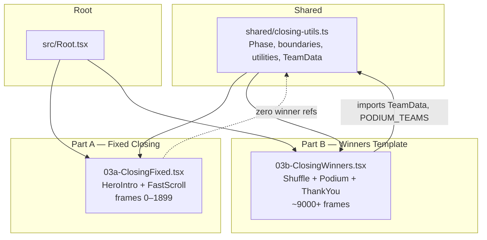

# Design Document: Closing Podium Template

## Overview

This design covers splitting `03-GameDayStreamClosing-Audio.tsx` into two independent composition files and redesigning the podium/winners section as a bottom-aligned bar-chart layout. The split separates pre-rendered content (Part A: HeroIntro + FastScroll) from game-day-dependent content (Part B: Shuffle → Reveal/Podium → ThankYou). The podium redesign replaces the current floating-card layout with proportional vertical bars anchored to the viewport bottom, revealing teams from 6th to 1st with staged animations.

### Key Design Decisions

1. **Two-file split** rather than parameterized single file — Part A has zero winner data dependencies, enabling ahead-of-time rendering. Part B is a self-contained template with placeholder data that gets swapped on game day.
2. **Shared utilities via re-export** — A `shared/closing-utils.ts` module holds the Phase enum, phase boundaries, and all pure utility functions. Both Part A and Part B import from it, and the old import path re-exports everything for backward compatibility.
3. **Bar-chart podium** — Bottom-aligned bars with heights proportional to `score / maxScore` replace the floating card layout. This gives viewers an instant visual comparison of team performance.
4. **5-minute ceremony budget** — The entire Reveal/Podium sequence fits within 9000 frames (5 min at 30fps), with explicit frame allocations per reveal step.

## Architecture

The current monolithic closing file becomes three modules:



### Part B Phase Timeline (Winners Template)

```mermaid
gantt
    title Part B — Winners Template Timeline
    dateFormat X
    axisFormat %s

    section Shuffle
    Shuffle phase (0–1799)       :0, 1800

    section Reveal 6th–4th
    6th place (1800–2399)        :1800, 2400
    5th place (2400–2999)        :2400, 3000
    4th place (3000–3599)        :3000, 3600

    section Reveal 3rd–1st
    3rd bar-rise + country + UG (3600–4799)  :3600, 4800
    2nd bar-rise + country + UG (4800–5999)  :4800, 6000
    1st bar-rise + country + UG (6000–7199)  :6000, 7200

    section Roll Call + ThankYou
    Team name roll call (7200–7799)  :7200, 7800
    ThankYou + fade (7800–8999)      :7800, 9000
```



### File Mapping

| Current Export | New Source File | Notes |
|---|---|---|
| `GameDayClosing` | Removed (replaced by Part A + Part B) | Root.tsx drops this import |
| `ClosingShowcase` | `03a-ClosingFixed.tsx` | Standalone sub-composition |
| `ClosingReveal` | `03b-ClosingWinners.tsx` | Standalone sub-composition |
| `ClosingFinalStandings` | `03b-ClosingWinners.tsx` | Standalone sub-composition |
| `ClosingTeamPodium` | `03b-ClosingWinners.tsx` | Standalone sub-composition |
| `ClosingThankYou` | `03b-ClosingWinners.tsx` | Standalone sub-composition |
| Phase, utilities, TeamData | `shared/closing-utils.ts` | Shared by both files |

## Components and Interfaces

### shared/closing-utils.ts — Shared Module

Contains all pure functions and data types used by both Part A and Part B:

```typescript
// Phase enum and boundaries
export enum Phase { Showcase, Shuffle, Reveal, ThankYou }
export const PHASE_BOUNDARIES = { ... };

// Pure utility functions (all exported for testing)
export function getActivePhase(frame: number): Phase;
export function isTransitionFrame(frame: number): boolean;
export function getFadeOpacity(frame: number): number;
export function getCountUpValue(target: number, frame: number, revealFrame: number): number;
export function getPodiumBarHeight(score: number, maxScore: number, maxHeight: number): number;
export function getRevealedPlacements(frame: number): number[];
export function getShowcasePage(frame: number, groupCount: number): number;
export function getAllShowcasePages(groupCount: number): number;
export function getShuffleCycleSpeed(frameInPhase: number): number;

// Reveal timing
export const REVEAL_SCHEDULE: Array<{ rank: number; frame: number; duration: number }>;
export const REVEAL_FRAMES: Record<number, number>;

// TeamData interface
export interface TeamData {
  name: string;
  flag: string;
  city: string;
  country: string;
  score: number;
  logoUrl: string | null;
}

// Placeholder team data (no lorem ipsum)
export const PODIUM_TEAMS: TeamData[];
export const WINNING_CITY_TEAMS: TeamData[];
```

### 03a-ClosingFixed.tsx — Part A

Contains HeroIntro (Scenes 1–5) and FastScroll. Zero references to `PODIUM_TEAMS` or `WINNING_CITY_TEAMS`.

Exports:
- `GameDayClosingFixed` — main composition (1900 frames)
- `ClosingShowcase` — standalone sub-composition for Remotion Studio

### 03b-ClosingWinners.tsx — Part B

Contains Shuffle, Reveal/Podium, and ThankYou phases. Uses the redesigned bar-chart podium.

Exports:
- `GameDayClosingWinners` — main composition (~9000 frames)
- `ClosingReveal`, `ClosingFinalStandings`, `ClosingTeamPodium`, `ClosingThankYou` — standalone sub-compositions

### PodiumBar Component (New)

The core visual element of the redesigned podium. Each bar is a vertical rectangle anchored to the bottom of the viewport.

```typescript
interface PodiumBarProps {
  team: TeamData;
  rank: number;
  barHeight: number;       // computed via getPodiumBarHeight
  barWidth: number;        // varies by rank tier
  isTop3: boolean;         // full opacity vs reduced
  revealFrame: number;     // when this bar starts animating
  frame: number;           // current frame
}
```

**Bar layout (6 bars, bottom-aligned):**

```
┌──────────────────────────────────────────────────────┐
│                    PODIUM (title)                      │  top 15%
│                                                        │
│                                                        │
│   ┌───┐                                               │
│   │   │  ┌───┐                              ┌───┐    │
│   │ 2 │  │   │                    ┌───┐     │   │    │
│   │   │  │ 1 │         ┌───┐     │ 5 │     │ 4 │    │
│   │   │  │   │  ┌───┐  │ 6 │     │   │     │   │    │
│   │   │  │   │  │ 3 │  │   │     │   │     │   │    │
├───┴───┴──┴───┴──┴───┴──┴───┴─────┴───┴─────┴───┴────┤  bottom edge
│  Primary row (1-2-3)    │   Secondary row (4-5-6)     │
│  full opacity            │   reduced opacity (0.5-0.8) │
└──────────────────────────────────────────────────────┘
```

The primary row (places 1, 2, 3) is centered in the left ~60% of the viewport. The secondary row (places 4, 5, 6) occupies the right ~40%, positioned slightly lower with reduced opacity.

**Bar height formula:**
```typescript
function getPodiumBarHeight(score: number, maxScore: number, maxHeight: number): number {
  return Math.max(0.4, score / maxScore) * maxHeight;
}
```
- `maxHeight` = ~400px (leaving room for title and team info above bars)
- Minimum bar height is 40% of max to keep all bars visible
- 1st place always gets full `maxHeight`

**Bar content (bottom to top):**
1. Score value at the base of the bar
2. Team name (largest text, using TYPOGRAPHY.h5 for top 3, TYPOGRAPHY.h6 for 4-6)
3. City + Country
4. Logo (or flag emoji fallback)
5. Rank badge (#1 🥇, #2 🥈, #3 🥉, #4, #5, #6)

### Reveal Animation Sequence

The reveal follows a strict order with three animation stages per top-3 team:

**Phase 1: Places 6→4 (quick reveals)**
- Each place gets ~600 frames (20 seconds)
- Bar appears at reduced opacity (0.5–0.8) with a spring rise from 0 to proportional height
- Team name and score visible immediately

**Phase 2: Places 3→1 (dramatic reveals)**
- Each place gets ~1200 frames (40 seconds)
- Stage A (~400 frames): Bar rises from 0 to proportional height using `springConfig.emphasis`
- Stage B (~400 frames): Country name fades in below the bar
- Stage C (~400 frames): User group name + logo fade in

**Phase 3: Roll Call**
- All 6 team names displayed sequentially from 6th to 1st
- Each name shown for ~100 frames with staggered entry

### Animation Timing Budget (Part B)

| Segment | Start Frame | End Frame | Duration | Seconds |
|---|---|---|---|---|
| Shuffle | 0 | 1799 | 1800 | 60s |
| 6th place reveal | 1800 | 2399 | 600 | 20s |
| 5th place reveal | 2400 | 2999 | 600 | 20s |
| 4th place reveal | 3000 | 3599 | 600 | 20s |
| 3rd place (bar + country + UG) | 3600 | 4799 | 1200 | 40s |
| 2nd place (bar + country + UG) | 4800 | 5999 | 1200 | 40s |
| 1st place (bar + country + UG) | 6000 | 7199 | 1200 | 40s |
| Roll call (6th→1st) | 7200 | 7799 | 600 | 20s |
| ThankYou + fade to black | 7800 | 8999 | 1200 | 40s |
| **Total** | 0 | 8999 | 9000 | **300s (5 min)** |

### Root.tsx Registration

```typescript
// Old import removed:
// import { GameDayClosing, ... } from "../03-GameDayStreamClosing-Audio";

// New imports:
import { GameDayClosingFixed, ClosingShowcase } from "../03a-ClosingFixed";
import {
  GameDayClosingWinners,
  ClosingReveal,
  ClosingFinalStandings,
  ClosingTeamPodium,
  ClosingThankYou,
} from "../03b-ClosingWinners";

// Compositions:
// "GameDayClosingFixed" — 1900 frames, 1280×720, 30fps
// "GameDayClosingWinners" — 9000 frames, 1280×720, 30fps
// Sub-compositions remain registered with same IDs
```

## Data Models

### TeamData Interface (Enhanced)

The existing `TeamData` interface gains a `country` field to support the reveal animation's country-reveal step:

```typescript
export interface TeamData {
  name: string;      // Team/user group display name
  flag: string;      // Country flag emoji (e.g., "🇦🇹")
  city: string;      // City name (e.g., "Vienna")
  country: string;   // Country name (e.g., "Austria")
  score: number;     // Final score (positive integer)
  logoUrl: string | null;  // User group logo URL, null for flag fallback
}
```

### Placeholder Data (No Lorem Ipsum)

```typescript
export const PODIUM_TEAMS: TeamData[] = [
  { name: "Team #1", flag: "🏳️", city: "City A", country: "Country A", score: 4850, logoUrl: null },
  { name: "Team #2", flag: "🏳️", city: "City B", country: "Country B", score: 4720, logoUrl: null },
  { name: "Team #3", flag: "🏳️", city: "City C", country: "Country C", score: 4580, logoUrl: null },
  { name: "Team #4", flag: "🏳️", city: "City D", country: "Country D", score: 4410, logoUrl: null },
  { name: "Team #5", flag: "🏳️", city: "City E", country: "Country E", score: 4250, logoUrl: null },
  { name: "Team #6", flag: "🏳️", city: "City F", country: "Country F", score: 4090, logoUrl: null },
];
```

Scores are distinct and strictly descending. Index 0 = 1st place. All `logoUrl` fields are `null` (flag fallback) since actual logos are filled on game day.

## Correctness Properties

*A property is a characteristic or behavior that should hold true across all valid executions of a system — essentially, a formal statement about what the system should do. Properties serve as the bridge between human-readable specifications and machine-verifiable correctness guarantees.*

### Property 1: Part A Contains Zero Winner Data References

*For any* string in the source text of `03a-ClosingFixed.tsx`, the file shall not contain the identifiers `PODIUM_TEAMS`, `WINNING_CITY_TEAMS`, `TeamData`, or any reference to winner/podium data arrays.

**Validates: Requirements 1.2**

### Property 2: TeamData Interface Completeness

*For any* object conforming to the `TeamData` interface, it shall have exactly the fields: `name` (string), `flag` (string), `city` (string), `country` (string), `score` (number), and `logoUrl` (string | null). No additional required fields exist, and no fields are missing.

**Validates: Requirements 2.2**

### Property 3: Placeholder Data Validity

*For any* element in the `PODIUM_TEAMS` array: (a) the array has exactly 6 elements, (b) each element's `name` matches the pattern "Team #N" where N is 1–6, (c) no string field in any element contains "lorem", "ipsum", "dolor", "sit amet", or other lorem ipsum fragments, (d) scores are distinct and strictly descending by index.

**Validates: Requirements 2.3, 2.4**

### Property 4: Podium Bar Height Proportionality

*For any* positive `teamScore` ≤ `maxScore` and positive `maxHeight`, the function `getPodiumBarHeight(teamScore, maxScore, maxHeight)` shall return `max(0.4, teamScore / maxScore) * maxHeight`. The result is always ≥ `0.4 * maxHeight` and ≤ `maxHeight`. For any two teams where `scoreA > scoreB`, `getPodiumBarHeight(scoreA, ...) > getPodiumBarHeight(scoreB, ...)`.

**Validates: Requirements 3.2**

### Property 5: Reveal Ordering

*For any* frame in the reveal phase, `getRevealedPlacements(frame)` shall return ranks in the order they were revealed: 6th first, then 5th, 4th, 3rd, 2nd, 1st. At no frame shall a higher-ranked team be revealed before a lower-ranked team. The roll call sequence shall also present teams from 6th to 1st.

**Validates: Requirements 4.1, 4.8**

### Property 6: Total Frame Budget

*For any* valid Part B timing configuration, the total frame count shall equal exactly 9000 frames. The sum of all phase durations (Shuffle + Reveal + Roll Call + ThankYou) shall not exceed 9000.

**Validates: Requirements 5.1**

### Property 7: Design System Compliance

*For any* color literal in `03b-ClosingWinners.tsx`, it shall be one of the GD palette values (GD_DARK, GD_PURPLE, GD_VIOLET, GD_PINK, GD_ACCENT, GD_ORANGE, GD_GOLD) or a derived rgba/opacity variant. *For any* `fontFamily` declaration, it shall reference `'Inter'`. *For any* `fontSize` value, it shall reference a `TYPOGRAPHY` constant rather than a hardcoded number.

**Validates: Requirements 5.2, 5.4, 5.5**

### Property 8: Backward Compatibility Re-exports

*For any* symbol previously exported from `03-GameDayStreamClosing-Audio.tsx` (Phase, PHASE_BOUNDARIES, getActivePhase, isTransitionFrame, getFadeOpacity, getCountUpValue, getPodiumBarHeight, getRevealedPlacements, getShowcasePage, getAllShowcasePages, getShuffleCycleSpeed, REVEAL_SCHEDULE, REVEAL_FRAMES, TeamData, PODIUM_TEAMS, WINNING_CITY_TEAMS), that symbol shall be importable from `shared/closing-utils.ts` after the split.

**Validates: Requirements 6.4**

## Error Handling

This feature operates on static, compile-time data with no runtime user input or network calls. Error scenarios are minimal:

1. **Missing logo URL**: When `logoUrl` is `null`, the PodiumBar renders the `flag` emoji as a visual fallback. This is the default state for all placeholder data.

2. **Division by zero in bar height**: If `maxScore` is 0, `getPodiumBarHeight` would divide by zero. Since `PODIUM_TEAMS` scores are hardcoded positive integers, this cannot occur. The `Math.max(0.4, ...)` clamp provides a defensive floor regardless.

3. **Frame out of range**: Spring animations gracefully handle negative elapsed frames (returning 0 progress). The phase routing logic uses `>=` comparisons that naturally handle boundary frames.

4. **Import path breakage after split**: The `shared/closing-utils.ts` module serves as the single source of truth. If the old `03-GameDayStreamClosing-Audio.tsx` file is kept temporarily, it can re-export from `shared/closing-utils.ts` for backward compatibility. Once all consumers are updated, the old file is deleted.

5. **Missing shared module**: If `shared/closing-utils.ts` is not created before the composition files, TypeScript compilation fails immediately with clear import errors. This is caught at build time, not runtime.

## Testing Strategy

### Property-Based Testing

Use **fast-check** as the property-based testing library (already used in this project's existing tests).

Each property test must:
- Run a minimum of 100 iterations
- Reference the design property with a tag comment
- Use `fc.assert(fc.property(...))` pattern

Property tests to implement:

1. **Property 1 test**: Read `03a-ClosingFixed.tsx` source, verify zero occurrences of winner-related identifiers
   - Tag: `Feature: closing-podium-template, Property 1: Part A Contains Zero Winner Data References`

2. **Property 2 test**: Generate random TeamData objects using fast-check arbitraries, verify all required fields exist with correct types
   - Tag: `Feature: closing-podium-template, Property 2: TeamData Interface Completeness`

3. **Property 3 test**: Validate the static PODIUM_TEAMS array: 6 elements, "Team #N" naming, no lorem ipsum strings, descending scores
   - Tag: `Feature: closing-podium-template, Property 3: Placeholder Data Validity`

4. **Property 4 test**: Generate random (score, maxScore, maxHeight) triples, verify getPodiumBarHeight formula, bounds, and ordering
   - Tag: `Feature: closing-podium-template, Property 4: Podium Bar Height Proportionality`

5. **Property 5 test**: Generate random frames across the reveal phase range, verify getRevealedPlacements returns ranks in 6→1 order
   - Tag: `Feature: closing-podium-template, Property 5: Reveal Ordering`

6. **Property 6 test**: Verify the sum of all Part B phase durations equals 9000 frames
   - Tag: `Feature: closing-podium-template, Property 6: Total Frame Budget`

7. **Property 7 test**: Read `03b-ClosingWinners.tsx` source, scan for color literals, font families, and font sizes to verify design system compliance
   - Tag: `Feature: closing-podium-template, Property 7: Design System Compliance`

8. **Property 8 test**: Verify all previously exported symbols are importable from `shared/closing-utils.ts`
   - Tag: `Feature: closing-podium-template, Property 8: Backward Compatibility Re-exports`

### Unit Tests

Unit tests complement property tests for specific examples and edge cases:

- **getPodiumBarHeight edge cases**: score = maxScore (returns maxHeight), score = 0 (returns 0.4 * maxHeight), score = maxScore * 0.4 (boundary)
- **getRevealedPlacements specific frames**: frame 0 → empty, frame 1800 → [6], frame 3600 → [6,5,4,3], frame 7200 → [6,5,4,3,2,1]
- **Phase routing**: verify correct phase component renders at boundary frames
- **Root.tsx registration**: verify composition IDs, frame counts, and resolution values

### Test Configuration

```typescript
import fc from "fast-check";

// All property tests use minimum 100 iterations
const FC_CONFIG = { numRuns: 100 };

fc.assert(
  fc.property(/* arbitraries */, (/* values */) => {
    // property assertion
  }),
  FC_CONFIG,
);
```

Test file: `__tests__/closing-podium-template.property.test.ts`

Pure utility functions (`getPodiumBarHeight`, `getRevealedPlacements`, `getActivePhase`, etc.) are exported from `shared/closing-utils.ts` for direct testing without React rendering context.
