# Design Document: GameDay MainEvent Redesign

## Overview

This design covers the redesign of `2-GameDayStreamMainEvent.tsx`, a Remotion composition (1280×720, 30fps, 54000 frames / 30 minutes). The redesign targets the first ~60 seconds (frames 0–1799) where Linda Mohamed hosts, plus persistent UI elements spanning the full composition.

The core changes are:

1. **Fix visual bugs**: Remove hard map edges (borderRadius → vignette), normalize label font sizes
2. **Two-phase StreamHostCard**: Full-width V4-style card during greeting (0–239), compact from 240+
3. **SpeakerBubble greeting**: Chat-bubble greeting text above the full-width card at frame 0
4. **Complete moderation coverage**: 6 info cards (frames 240–1799) matching the spoken script order
5. **SpeakerBubbles system**: Current + next speaker avatars visible from frame 0 through 53999
6. **Sidebar compact mode**: Shrinks from 42% → 28% at frame 1800 when Jerome & Anda appear
7. **OrganizerSection**: Persistent Jerome/Anda cards from frame 1800–9000
8. **PhaseTimeline**: Replaces PhaseMarker with horizontal progress bar + snail mascot
9. **Schedule cards**: Hide redundant speaker names (SpeakerBubbles handles that now)

All changes are additive except PhaseMarker → PhaseTimeline replacement. The `MAIN_EVENT_SEGMENTS` and `TIMELINE_CHAPTERS` arrays remain immutable.

## Architecture

The composition follows a layered architecture within a single `AbsoluteFill` container. Each layer is positioned absolutely and z-ordered by render order in JSX.

```mermaid
graph TD
    subgraph "AbsoluteFill (1280×720)"
        L1[BackgroundLayer + HexGridOverlay]
        L1b[EuropeMap with vignette]
        L2[AudioBadge - bottom-right]
        L3[CountdownTimer - top-left]
        L4[SpeakerBubbles - top-left below countdown]
        L5[SpeakerBubble Greeting - above StreamHostCard, frames 0-239]
        L6[StreamHostCard - full-width 0-239, compact 240+]
        L7[InfoCardDisplay - left column, frames 240-1799]
        L8[ScheduleSidebar - right side, slides in at frame 900]
        L9[OrganizerSection - left column, frames 1800-9000]
        L10[PhaseTimeline - bottom, full width]
    end

    L1 --> L1b --> L2 --> L3 --> L4 --> L5 --> L6 --> L7 --> L8 --> L9 --> L10
```



### Frame-Based Layout Phases

```mermaid
gantt
    title Composition Layout Phases (frames 0–9000)
    dateFormat X
    axisFormat %s

    section Greeting Phase (0-239)
    SpeakerBubble Greeting       :0, 240
    StreamHostCard FullWidth     :0, 240
    SpeakerBubbles (Linda)       :0, 240

    section Info Cards Phase (240-1799)
    Welcome Card                 :240, 540
    Countdown Explanation        :540, 780
    Audio Check                  :780, 1020
    Mute Warning                 :1020, 1350
    Community Organized          :1350, 1560
    Meet Organizers              :1560, 1800
    StreamHostCard Compact       :240, 1800
    Sidebar slides in at 900     :900, 1800

    section Jerome & Anda Phase (1800-9000)
    Sidebar Compact (28%)        :1800, 9000
    OrganizerSection             :1800, 9000
    SpeakerBubbles (Jerome/Anda) :1800, 9000

```



### Key Architectural Decisions

1. **Single-file component approach**: All new sub-components (SpeakerBubbles, PhaseTimeline, OrganizerSection, etc.) live in `2-GameDayStreamMainEvent.tsx` alongside existing components. This matches the current pattern and avoids import complexity for a composition that is self-contained.

2. **Frame-driven state, not React state**: All visibility, positioning, and animation are derived from `useCurrentFrame()`. No `useState` or `useEffect` — pure functions of frame number, consistent with Remotion best practices.

3. **Spring animations from DesignSystem**: All entry/exit animations use `springConfig.entry`, `springConfig.exit`, or `springConfig.emphasis` from `GameDayDesignSystem.tsx`. No custom spring configs.

4. **Immutable data arrays**: `MAIN_EVENT_SEGMENTS` and `TIMELINE_CHAPTERS` are not modified. New data (info card definitions, speaker mappings) are defined as separate constants.

5. **V4 archive reference for full-width card**: The `StreamHostCard_FullWidth` styling references `CardCoverV4` from the V4 archive for the UG logo cover area, adapted to the current design system.

## Components and Interfaces

### New Components

#### `SpeakerBubbles`
```typescript
const SpeakerBubbles: React.FC<{
  frame: number;
  fps: number;
  segments: ScheduleSegment[];
  chapters: ScheduleSegment[];
}>
```
- Renders current speaker (64px circle, GD_VIOLET glow border) and next speaker (40px circle, GD_PURPLE 50% opacity border)
- Derives speaker from `TIMELINE_CHAPTERS` based on current frame
- Positioned top-left, below the CountdownTimer
- Visible frames 0–53999
- Speaker name text below/beside the current speaker avatar
- Spring-animated transitions when speaker changes

#### `SpeakerBubbleGreeting`
```typescript
const SpeakerBubbleGreeting: React.FC<{
  frame: number;
  fps: number;
}>
```
- Chat/speech bubble with greeting text: "Hello everyone! I will guide you through the stream today! Make sure you have your audio turned on for the next 30 minutes"
- Positioned above the StreamHostCard_FullWidth
- Visible frames 0–239, fades out with spring exit
- Uses GlassCard styling with a speech bubble tail

#### `StreamHostCard` (Modified)
```typescript
const StreamHostCard: React.FC<{
  frame: number;
  fps: number;
}>
```
- **Frames 0–239**: Full-width layout (composition width minus 36px margins each side = 1208px)
  - Left side: circular avatar (80px) with GD_VIOLET glow, "YOUR STREAM HOST" label, "Linda Mohamed" name, full title, 🇦🇹 + "Vienna, Austria" with pin icon
  - Right side: UG Vienna logo as card cover (V4 CardCoverV4 style), "AWS UG Vienna" label below
  - GlassCard with accent glow line (borderLeft: 4px solid GD_VIOLET)
- **Frame 240+**: Animates to compact mode (50% width, left: 36) using springConfig.entry
  - Compact layout: avatar (64px), name, title, small UG logo (existing layout)
- Bottom position with ≥120px clearance above PhaseTimeline

#### `InfoCardDisplay` (Modified)
```typescript
const InfoCardDisplay: React.FC<{
  frame: number;
  fps: number;
}>
```
- 6 cards covering frames 240–1799 (not 0–239, which is greeting phase)
- Card sequence: Welcome → Countdown Explanation → Audio Check → Mute Warning → Community Organized → Meet Organizers
- Spring entry + fade exit with ≥20 frame transitions
- No gaps >30 frames between cards
- Highlight styling: critical phrases in borderColor with fontWeight 700
- Label font size: 14–16px, consistent with all other labels

#### `OrganizerSection`
```typescript
const OrganizerSection: React.FC<{
  frame: number;
  fps: number;
}>
```
- Two OrganizerCards side by side (Jerome + Anda)
- Each card: circular face avatar (borderRadius 50%, GD_VIOLET glow), name, UG affiliation, location
- "Currently Speaking" contextual label
- Visible frames 1800–9000, spring entry + spring exit at 9000
- GlassCard styling

#### `PhaseTimeline`
```typescript
const PhaseTimeline: React.FC<{
  frame: number;
  segments: ScheduleSegment[];
  totalFrames: number;
}>
```
- Horizontal progress bar at bottom of screen
- Left: "Current Phase / {phase label}"
- Milestone markers: Game Start, Gameplay ~2h, Ceremony
- Snail mascot icon moves along bar based on frame/totalFrames
- GlassCard background, DesignSystem colors
- Replaces PhaseMarker

### Modified Components

#### `ScheduleCard` (Modified)
- Remove rendering of `segment.speakers` text
- Keep speakers field in data (consumed by SpeakerBubbles)
- Display only: segment label + active/completed/upcoming indicators

#### `ScheduleSidebar` (Modified — inline in GameDayMainEvent)
- Slides in at frame 900 (changed from 600)
- At frame 1800: animate width from 42% → 28% using springConfig.entry
- Compact mode: smaller font sizes, tighter padding
- Stays compact for remaining duration (1800–53999)

#### `EuropeMap` (Modified — inline in GameDayMainEvent)
- Remove `borderRadius: 24` and `overflow: hidden` from container
- Use oversized container (≥20% larger: ~1080×600 instead of 900×500)
- Radial vignette fades all edges to full transparency before container boundary
- No visible hard edges against GD_DARK

### Unchanged Components
- `AudioBadge` — no changes
- `BackgroundLayer` — no changes
- `HexGridOverlay` — no changes
- `GlassCard` — no changes (consumed by new components)

## Data Models

### Updated `INTRO_INFO_CARDS` Array

The info cards are restructured to cover frames 240–1799 with 6 cards matching the moderation script order:

```typescript
interface InfoCard {
  text: string;
  startFrame: number;
  endFrame: number;
  borderColor: string;
  label?: string;
  highlight?: { text: string; color: string };
  // New optional fields for organizer card
  organizers?: Array<{
    name: string;
    face: string;       // staticFile path
    ug: string;         // User Group name
    location: string;   // City
    flag?: string;      // Emoji flag
  }>;
}

const INTRO_INFO_CARDS: InfoCard[] = [
  {
    text: "53+ AWS User Groups across 20+ countries competing simultaneously",
    startFrame: 240, endFrame: 539,
    borderColor: GD_ACCENT,
    label: "FIRST AWS COMMUNITY GAMEDAY EUROPE",
  },
  {
    text: "The countdown at the top shows 30 minutes until game start — keep an eye on it",
    startFrame: 540, endFrame: 779,
    borderColor: GD_VIOLET,
    label: "COUNTDOWN TO GAME START",
  },
  {
    text: "Connect your audio now — if it's not working, use the provided fallback video so you don't miss the GameDay instructions",
    startFrame: 780, endFrame: 1019,
    borderColor: GD_ORANGE,
    label: "AUDIO CHECK",
    highlight: { text: "Connect your audio now", color: GD_ORANGE },
  },
  {
    text: "This stream will be muted during gameplay — we'll be back when the timer runs out to celebrate the global winners together",
    startFrame: 1020, endFrame: 1349,
    borderColor: GD_PINK,
    label: "IMPORTANT",
    highlight: { text: "muted during gameplay", color: GD_PINK },
  },
  {
    text: "Everything behind this event was organized by volunteers — people who are not employed by AWS, just like every User Group leader in the 53 participating cities",
    startFrame: 1350, endFrame: 1559,
    borderColor: GD_PINK,
    label: "ORGANIZED BY THE COMMUNITY",
    highlight: { text: "not employed by AWS", color: GD_ACCENT },
  },
  {
    text: "The two most important people behind this initiative — they will walk you through the GameDay details",
    startFrame: 1560, endFrame: 1799,
    borderColor: GD_VIOLET,
    label: "MEET THE ORGANIZERS",
    organizers: [
      { name: "Jerome", face: "AWSCommunityGameDayEurope/faces/jerome.jpg", ug: "AWS User Group Belgium", location: "Brussels", flag: "🇧🇪" },
      { name: "Anda", face: "AWSCommunityGameDayEurope/faces/anda.jpg", ug: "AWS User Group Geneva", location: "Geneva", flag: "🇨🇭" },
    ],
  },
];
```

### Speaker Mapping

Speaker data is derived from `TIMELINE_CHAPTERS.speakers` field. A helper maps speaker names to face image paths:

```typescript
const SPEAKER_FACES: Record<string, string> = {
  "Linda Mohamed": "AWSCommunityGameDayEurope/faces/linda.jpg",
  "Jerome": "AWSCommunityGameDayEurope/faces/jerome.jpg",
  "Anda": "AWSCommunityGameDayEurope/faces/anda.jpg",
};

function getCurrentSpeaker(frame: number, chapters: ScheduleSegment[]): {
  current: { name: string; face: string } | null;
  next: { name: string; face: string } | null;
} {
  // Find active chapter, extract speaker, find next chapter with different speaker
}
```

### PhaseTimeline Milestones

```typescript
const PHASE_MILESTONES = [
  { label: "Game Start", position: 0.056 },   // frame 3000 / 54000
  { label: "Gameplay ~2h", position: 0.5 },    // midpoint
  { label: "Ceremony", position: 0.89 },       // frame 48000 / 54000
];
```

### Layout Constants

```typescript
const LAYOUT = {
  MARGIN: 36,
  SIDEBAR_WIDTH_FULL: "42%",
  SIDEBAR_WIDTH_COMPACT: "28%",
  SIDEBAR_ENTRY_FRAME: 900,
  SIDEBAR_COMPACT_FRAME: 1800,
  GREETING_END_FRAME: 239,
  INFO_CARDS_START_FRAME: 240,
  INFO_CARDS_END_FRAME: 1799,
  ORGANIZER_START_FRAME: 1800,
  ORGANIZER_END_FRAME: 9000,
  PHASE_TIMELINE_HEIGHT: 80,
  LABEL_FONT_SIZE: 15,  // Consistent 15px for all section labels
};
```


## Correctness Properties

*A property is a characteristic or behavior that should hold true across all valid executions of a system — essentially, a formal statement about what the system should do. Properties serve as the bridge between human-readable specifications and machine-verifiable correctness guarantees.*

### Property 1: EuropeMap uses vignette without borderRadius

*For any* frame between 0 and 12000 where the EuropeMap is visible, the map container SHALL have a radial-gradient vignette style and SHALL NOT have borderRadius set on the container element.

**Validates: Requirements 1.1, 1.2**

### Property 2: EuropeMap oversized container

*For any* frame where the EuropeMap is visible, the map container dimensions SHALL be at least 20% larger than the visible map image area (i.e., container width ≥ 1.2× image width and container height ≥ 1.2× image height).

**Validates: Requirements 1.4**

### Property 3: StreamHostCard two-phase width

*For any* frame in 0–239, the StreamHostCard width SHALL be full composition width minus margins (≥1200px). *For any* frame ≥ 300 (after spring settles), the StreamHostCard width SHALL be approximately 50% of composition width.

**Validates: Requirements 2.1, 2.5**

### Property 4: StreamHostCard clearance above PhaseTimeline

*For any* frame where the StreamHostCard is visible (0–1799), the StreamHostCard bottom edge SHALL leave at least 120px of clear space above the bottom of the composition for the PhaseTimeline.

**Validates: Requirements 2.7**

### Property 5: Sidebar entry delayed to frame 900

*For any* frame < 900, the ScheduleSidebar SHALL not be visible (opacity ≈ 0 or translated fully off-screen). *For any* frame ≥ 960 (after spring settles), the sidebar SHALL be visible.

**Validates: Requirements 2.9**

### Property 6: Consistent label font sizes

*For all* section labels in the Intro_Section (CountdownTimer label, ScheduleSidebar title, StreamHostCard "YOUR STREAM HOST" label, InfoCardDisplay card labels), the fontSize SHALL be the same value and that value SHALL be between 14px and 16px inclusive, with consistent letterSpacing and textTransform "uppercase".

**Validates: Requirements 3.1, 3.2, 3.3, 3.4**

### Property 7: Info card sequencing and coverage

*For all* cards in INTRO_INFO_CARDS: (a) cards SHALL be sorted by startFrame in ascending order, (b) all startFrame values SHALL be ≥ 240, (c) no two cards SHALL have overlapping frame ranges, (d) the gap between consecutive cards (card[i+1].startFrame − card[i].endFrame) SHALL be ≤ 10 frames, (e) each card duration (endFrame − startFrame + 1) SHALL be ≥ 240 frames, and (f) the union of all card ranges SHALL cover frames 240–1799 with no gap > 30 frames.

**Validates: Requirements 4.7, 6.1, 6.3, 6.4, 6.5, 6.6**

### Property 8: Info card highlight styling coherence

*For all* InfoCards that have a `highlight` field, the highlight color SHALL equal the card's `borderColor`, and the highlighted text SHALL be rendered with fontWeight 700.

**Validates: Requirements 8.1, 8.2, 8.3**

### Property 9: Organizer avatar styling

*For all* organizer face avatars (in both the InfoCardDisplay organizer card and the OrganizerSection), the avatar SHALL have borderRadius "50%" and a boxShadow containing the GD_VIOLET color value.

**Validates: Requirements 10.5**

### Property 10: SpeakerBubble greeting visibility window

*For any* frame in 0–219 (before fade begins), the SpeakerBubble greeting SHALL be visible (opacity > 0). *For any* frame ≥ 260 (after fade completes), the greeting SHALL not be visible (opacity ≈ 0).

**Validates: Requirements 11.3, 11.4**

### Property 11: Linda is current speaker during intro

*For any* frame in 0–1799, the `getCurrentSpeaker` function SHALL return Linda Mohamed as the current speaker.

**Validates: Requirements 11.5**

### Property 12: SpeakerBubbles always show current speaker name

*For any* frame in 0–53999, the SpeakerBubbles component SHALL render a text element containing the current speaker's name.

**Validates: Requirements 11.6, 12.6**

### Property 13: SpeakerBubbles visible throughout composition

*For any* frame in 0–53999, the SpeakerBubbles component SHALL render (not return null), displaying both a current speaker bubble (~64px) and a next speaker bubble (~40px).

**Validates: Requirements 12.1, 12.2, 12.3, 11.7**

### Property 14: Sidebar compact mode after frame 1800

*For any* frame ≥ 1860 (after spring settles), the ScheduleSidebar width SHALL be approximately 28%. *For any* frame < 1800, the sidebar width SHALL be 42% (when visible).

**Validates: Requirements 13.1, 13.2**

### Property 15: Compact sidebar preserves all segments

*For any* frame ≥ 1800, the ScheduleSidebar SHALL render all 6 MAIN_EVENT_SEGMENTS labels in the compact layout.

**Validates: Requirements 13.3**

### Property 16: OrganizerSection visibility window

*For any* frame in 1860–8940 (after entry spring, before exit spring), the OrganizerSection SHALL be visible with both Jerome and Anda OrganizerCards rendered. *For any* frame < 1800 or > 9060 (after exit completes), the OrganizerSection SHALL not be visible.

**Validates: Requirements 14.1, 14.2, 14.6**

### Property 17: OrganizerCard required fields

*For all* OrganizerCards in the OrganizerSection, each card SHALL display a circular face avatar, a name string, a User Group affiliation string, and a location string.

**Validates: Requirements 14.3**

### Property 18: PhaseTimeline snail position proportional to frame

*For any* frame in 0–53999, the snail mascot position along the PhaseTimeline progress bar SHALL be proportional to `frame / totalFrames` (within a tolerance of ±2%).

**Validates: Requirements 15.4, 15.6**

### Property 19: PhaseTimeline displays current phase label

*For any* frame in 0–53999, the PhaseTimeline SHALL render a text element containing the label of the currently active segment from MAIN_EVENT_SEGMENTS.

**Validates: Requirements 15.2**

### Property 20: ScheduleCard hides speaker names

*For all* ScheduleSegments that have a `speakers` field, the rendered ScheduleCard SHALL NOT contain the speakers text string in its output.

**Validates: Requirements 16.1, 16.3**

## Error Handling

### Frame Boundary Safety

- All `interpolate()` calls use `extrapolateLeft: "clamp"` and `extrapolateRight: "clamp"` to prevent values outside expected ranges
- `spring()` calls naturally clamp to 0–1 range
- `getCurrentSpeaker()` returns `null` for frames with no speaker data (segments without `speakers` field) — SpeakerBubbles renders a generic placeholder in this case

### Missing Assets

- Face images (`linda.jpg`, `jerome.jpg`, `anda.jpg`) are loaded via `staticFile()` which throws at build time if missing — this is the desired behavior
- UG Vienna logo is loaded from an external URL — if it fails, the `Img` component renders nothing (Remotion default behavior). The card layout should not break.

### Data Integrity

- `MAIN_EVENT_SEGMENTS` and `TIMELINE_CHAPTERS` are `const` arrays — TypeScript prevents reassignment
- `INTRO_INFO_CARDS` is a new `const` array with validated frame ranges (no overlaps, full coverage)
- `SPEAKER_FACES` map has entries for all speakers referenced in TIMELINE_CHAPTERS

### Edge Cases

- **Frame 0**: All components must render cleanly at the very first frame. SpeakerBubbles, greeting, and StreamHostCard_FullWidth all start at frame 0.
- **Frame 239→240 transition**: StreamHostCard animates from full to compact. Greeting fades out. First info card appears. These must not visually conflict.
- **Frame 1799→1800 transition**: Info cards end. OrganizerSection appears. Sidebar compacts. Multiple simultaneous transitions.
- **Frame 9000**: OrganizerSection exits. SpeakerBubbles continue.
- **Segments without speakers**: Some MAIN_EVENT_SEGMENTS entries have no `speakers` field (Support Process, Special Guest, etc.). SpeakerBubbles must handle gracefully.

## Testing Strategy

### Property-Based Testing (fast-check + vitest)

The project already uses `vitest` + `fast-check` for property-based tests (see `__tests__/gameday-mainevent-bugfix.property.test.ts`). New property tests follow the same pattern.

**Library**: `fast-check` (already installed)
**Runner**: `vitest` (already configured)
**Minimum iterations**: 100 per property test (`{ numRuns: 100 }`)

Each property test MUST:
- Reference its design document property with a tag comment
- Use `fc.assert(fc.property(...))` pattern
- Generate random frames within the relevant range using `fc.integer({ min, max })`
- Render components by calling the FC directly (no DOM — React element tree inspection)

**Tag format**: `Feature: gameday-mainevent-redesign, Property {N}: {title}`

Each correctness property (Properties 1–20) SHALL be implemented by a SINGLE property-based test.

### Unit Tests (vitest)

Unit tests cover specific examples and edge cases:
- INTRO_INFO_CARDS contains all 6 required cards with correct text content (Req 4.1–4.6)
- Organizer card data includes Jerome/Brussels and Anda/Geneva (Req 5.2, 5.3, 10.1–10.4)
- StreamHostCard_FullWidth contains all required text (Req 2.2, 2.3)
- MAIN_EVENT_SEGMENTS and TIMELINE_CHAPTERS arrays are unchanged (Req 17.3, 17.4)
- PhaseTimeline milestones include "Game Start", "Gameplay ~2h", "Ceremony" (Req 15.3)
- SpeakerBubbles at frame 0 shows Linda as current speaker (Req 11.1)
- CountdownTimer is visible before countdown explanation card (Req 9.2)

Unit tests should be minimal — property tests handle comprehensive input coverage.

### Visual Verification Strategy (Playwright MCP Browser)

After each major component implementation, visual verification is performed by rendering specific frames with `npx remotion still` and inspecting the output images using Playwright MCP browser tools.

#### Rendering Commands

```bash
# Render a specific frame as a PNG image
npx remotion still 2-GameDayStreamMainEvent --frame=0 --output=out/verify-frame-0.png
npx remotion still 2-GameDayStreamMainEvent --frame=120 --output=out/verify-frame-120.png
npx remotion still 2-GameDayStreamMainEvent --frame=240 --output=out/verify-frame-240.png
npx remotion still 2-GameDayStreamMainEvent --frame=900 --output=out/verify-frame-900.png
npx remotion still 2-GameDayStreamMainEvent --frame=1350 --output=out/verify-frame-1350.png
npx remotion still 2-GameDayStreamMainEvent --frame=1560 --output=out/verify-frame-1560.png
npx remotion still 2-GameDayStreamMainEvent --frame=1800 --output=out/verify-frame-1800.png
```

#### Key Frames and What to Verify

| Frame | Phase | Visual Checks |
|-------|-------|---------------|
| 0 | Greeting start | SpeakerBubble greeting visible above full-width StreamHostCard; Linda's speaker bubble (64px) top-left; countdown timer top-left; no info cards; Europe map with soft vignette edges |
| 120 | Mid-greeting | Greeting bubble still visible; full-width StreamHostCard still prominent; no sidebar yet |
| 240 | Transition | Greeting faded out; StreamHostCard animating to compact; first info card (Welcome) appearing; no sidebar yet |
| 900 | Sidebar entry | Sidebar sliding in from right (42% width); info card visible (Mute Warning or Community); StreamHostCard compact in left column; PhaseTimeline at bottom |
| 1350 | Community card | "ORGANIZED BY THE COMMUNITY" info card visible; highlight text "not employed by AWS" in accent color; sidebar fully visible |
| 1560 | Organizer card | "MEET THE ORGANIZERS" card with Jerome and Anda faces; Brussels and Geneva locations visible |
| 1800 | Jerome & Anda appear | Sidebar compacting to 28%; OrganizerSection appearing with two cards; SpeakerBubbles transitioning to Jerome & Anda; info cards gone |

#### Playwright MCP Verification Process

For each key frame:

1. **Render**: Run `npx remotion still` to produce a PNG at the target frame
2. **Open**: Use Playwright MCP browser to open the rendered image (`file:///path/to/out/verify-frame-{N}.png`)
3. **Inspect**: Visually verify:
   - No overlapping elements (greeting vs host card, info card vs sidebar, etc.)
   - Correct element visibility (greeting visible at 0, gone at 240; sidebar absent before 900)
   - Proper alignment (labels aligned, cards within margins, PhaseTimeline at bottom)
   - Vignette edges on Europe map (no sharp corners)
   - Font consistency (all labels same size)
   - Highlight styling on info cards (colored text, bold)
   - Organizer faces visible and circular at frame 1560
   - Sidebar width reduction visible at frame 1800
4. **Document**: Note any visual issues for correction

#### When to Run Visual Verification

Visual verification tasks are embedded after each major implementation milestone:
- After EuropeMap vignette fix → verify frame 0
- After StreamHostCard two-phase implementation → verify frames 0, 120, 240
- After InfoCardDisplay restructuring → verify frames 240, 900, 1350, 1560
- After SpeakerBubbles implementation → verify frames 0, 1800
- After Sidebar compact mode → verify frame 1800
- After OrganizerSection → verify frames 1560, 1800
- After PhaseTimeline → verify frames 0, 900, 1800
- Final integration check → verify all 7 key frames
