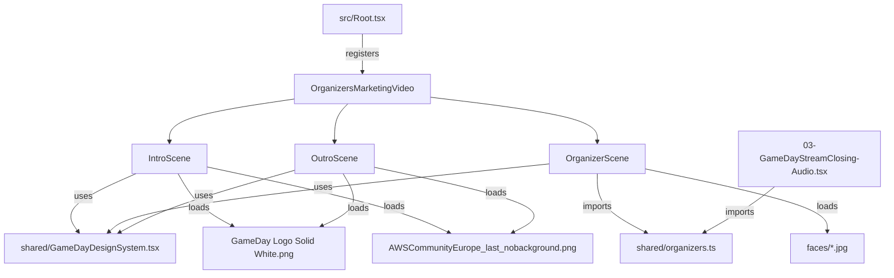

# Design Document: Organizers Marketing Video

## Overview

A standalone Remotion composition that produces a short marketing/social media video showcasing the 8 AWS Community GameDay Europe organizers. The video has three scenes — branded intro, organizer showcase grid, and outro — and is completely independent from the stream overlay pipeline.

The composition reuses the existing design system (`shared/GameDayDesignSystem.tsx`) for colors, backgrounds, and spring presets, and shares organizer data with the closing ceremony to avoid duplication.

### Key Design Decisions

1. **Single composition file** — `OrganizersMarketingVideo.tsx` at the project root (no numeric prefix, since it's not a stream overlay).
2. **Shared organizer data** — Extract the `ORGANIZERS` array from `03-GameDayStreamClosing-Audio.tsx` into `shared/organizers.ts` so both compositions import from one source.
3. **Scene 4 copy** — The organizer grid is a direct copy of the closing ceremony's Scene 4 (HeroIntro, frames 550–699) with timing adjusted to be relative to this composition's timeline.
4. **~15 second video** — Intro (~4s), Organizer Scene (~6s), Outro (~5s) ≈ 450 frames at 30fps. Short enough for social media.

## Architecture



The composition is a single React component that renders three scene layers using Remotion's `AbsoluteFill`, each gated by frame ranges. This matches the pattern used throughout the project (e.g., HeroIntro's scene switching).

### Timeline Layout (450 frames / 15s at 30fps)

| Scene | Frames | Duration | Description |
|-------|--------|----------|-------------|
| Intro | 0–119 | 4.0s | Logos + title animate in with springs |
| Organizer | 120–299 | 6.0s | 4×2 grid with staggered card entrances |
| Outro | 300–449 | 5.0s | Logos + tagline + fade to black |

Crossfade transitions: ~15 frames overlap between scenes using opacity interpolation.

## Components and Interfaces

### New Files

#### `shared/organizers.ts`
Shared organizer data module extracted from the closing ceremony.

```typescript
export interface Organizer {
  name: string;
  role: string;       // user group name
  country: string;
  flag: string;       // emoji flag
  face: string;       // path relative to public/
  type: "community";
}

export const ORGANIZERS: Organizer[] = [
  { name: "Jerome", role: "AWS User Group Belgium", country: "Belgium", flag: "🇧🇪", face: "AWSCommunityGameDayEurope/faces/jerome.jpg", type: "community" },
  { name: "Anda", role: "AWS User Group Geneva", country: "Switzerland", flag: "🇨🇭", face: "AWSCommunityGameDayEurope/faces/anda.jpg", type: "community" },
  { name: "Marcel", role: "AWS User Group Münsterland", country: "Germany", flag: "🇩🇪", face: "AWSCommunityGameDayEurope/faces/marcel.jpg", type: "community" },
  { name: "Linda", role: "AWS User Group Vienna", country: "Austria", flag: "🇦🇹", face: "AWSCommunityGameDayEurope/faces/linda.jpg", type: "community" },
  { name: "Manuel", role: "AWS User Group Frankfurt", country: "Germany", flag: "🇩🇪", face: "AWSCommunityGameDayEurope/faces/manuel.jpg", type: "community" },
  { name: "Andreas", role: "AWS User Group Bonn", country: "Germany", flag: "🇩🇪", face: "AWSCommunityGameDayEurope/faces/andreas.jpg", type: "community" },
  { name: "Lucian", role: "AWS User Group Timisoara", country: "Romania", flag: "🇷🇴", face: "AWSCommunityGameDayEurope/faces/lucian.jpg", type: "community" },
  { name: "Mihaly", role: "AWS User Group Budapest", country: "Hungary", flag: "🇭🇺", face: "AWSCommunityGameDayEurope/faces/mihaly.jpg", type: "community" },
];
```

#### `OrganizersMarketingVideo.tsx`
The standalone composition file containing three inline scene components.

```typescript
// Exports:
export const OrganizersMarketingVideo: React.FC = () => { ... }
```

**Internal structure:**
- Uses `useCurrentFrame()` and `useVideoConfig()` from Remotion
- Renders `BackgroundLayer` from design system as base
- Conditionally renders IntroScene, OrganizerScene, OutroScene based on frame ranges
- Each scene uses `spring()` and `interpolate()` for animations

### Scene Components (inline within composition file)

#### IntroScene (frames 0–119)
- Displays GameDay logo (spring entrance from top)
- Displays AWS Community Europe logo (spring entrance from bottom)
- Displays "AWS Community GameDay Europe" title text (fade + slide up)
- Ambient glow effect using radial gradient (GD_PURPLE/GD_VIOLET)
- Exit: opacity fade out in last 15 frames (105–119)

#### OrganizerScene (frames 120–299)
- Copied from closing ceremony Scene 4 with adjusted frame offsets
- Heading: "COMMUNITY GAMEDAY EUROPE ORGANIZERS" (spring entrance)
- Subheading: "From the Community, for the Community" in GD_GOLD
- 4×2 grid of organizer cards, each with:
  - 130×130px circular face photo
  - Purple glow box-shadow: `0 0 30px ${GD_VIOLET}70, 0 0 60px ${GD_PURPLE}40`
  - Name with flag emoji (white, bold, 20px)
  - User group name (subdued white, 14px)
  - Country (lighter subdued, 13px)
- Staggered spring entrance: each card delayed by 12 frames (matching closing ceremony)
- Entry: opacity fade in first 15 frames (120–134)
- Exit: opacity fade out last 15 frames (285–299)

#### OutroScene (frames 300–449)
- Radial gradient glow burst (GD_PURPLE → GD_VIOLET → transparent)
- GameDay logo + AWS Community Europe logo (spring entrance, centered)
- Tagline text: "AWS Community GameDay Europe · 17 March 2026" (fade in)
- Optional CTA: "communitygameday.eu" or similar (fade in, delayed)
- Fade to black: last 30 frames (420–449) interpolate background opacity to 1

### Modified Files

#### `src/Root.tsx`
Add one new `<Composition>` registration:
```typescript
import { OrganizersMarketingVideo } from "../OrganizersMarketingVideo";

<Composition
  id="OrganizersMarketingVideo"
  component={OrganizersMarketingVideo}
  durationInFrames={450}
  fps={30}
  width={1280}
  height={720}
/>
```

#### `03-GameDayStreamClosing-Audio.tsx`
Replace inline `ORGANIZERS` array with import from `shared/organizers.ts`:
```typescript
import { ORGANIZERS } from "./shared/organizers";
```

## Data Models

### Organizer Interface

```typescript
interface Organizer {
  name: string;       // Display name (e.g., "Jerome")
  role: string;       // User group name (e.g., "AWS User Group Belgium")
  country: string;    // Country name (e.g., "Belgium")
  flag: string;       // Emoji flag (e.g., "🇧🇪")
  face: string;       // Static file path relative to public/ (e.g., "AWSCommunityGameDayEurope/faces/jerome.jpg")
  type: "community";  // Organizer type (always "community" for now)
}
```

### Scene Timing Configuration

```typescript
// Frame constants for the marketing video
const TOTAL_FRAMES = 450;
const INTRO_START = 0;
const INTRO_END = 119;
const ORG_START = 120;
const ORG_END = 299;
const OUTRO_START = 300;
const OUTRO_END = 449;
const CROSSFADE_FRAMES = 15;
```

### Design System Dependencies

| Import | Source | Usage |
|--------|--------|-------|
| `GD_DARK, GD_PURPLE, GD_VIOLET, GD_PINK, GD_ACCENT, GD_GOLD` | `shared/GameDayDesignSystem.tsx` | Colors throughout all scenes |
| `BackgroundLayer` | `shared/GameDayDesignSystem.tsx` | Base background for entire composition |
| `springConfig` | `shared/GameDayDesignSystem.tsx` | Spring animation presets |
| `ORGANIZERS` | `shared/organizers.ts` | Organizer data for the grid |


## Correctness Properties

*A property is a characteristic or behavior that should hold true across all valid executions of a system — essentially, a formal statement about what the system should do. Properties serve as the bridge between human-readable specifications and machine-verifiable correctness guarantees.*

### Property 1: Organizer card completeness

*For any* organizer in the ORGANIZERS array, the rendered organizer card should contain: (a) an image element referencing the organizer's face path, (b) the organizer's flag emoji and name, (c) the organizer's user group role, and (d) the organizer's country.

**Validates: Requirements 3.5, 3.6, 3.7, 3.8**

### Property 2: Organizer count invariant

*For any* valid ORGANIZERS array, the organizer scene should render exactly `ORGANIZERS.length` organizer cards — no more, no fewer.

**Validates: Requirements 3.1**

### Property 3: Staggered animation ordering

*For any* two organizer cards at indices `i` and `j` where `i < j`, the animation start frame for card `i` should be strictly less than the animation start frame for card `j`.

**Validates: Requirements 3.2**

### Property 4: Scene crossfade transition

*For any* frame in the crossfade overlap region between two adjacent scenes, the exiting scene's opacity should be decreasing and the entering scene's opacity should be increasing, ensuring a smooth visual handoff.

**Validates: Requirements 2.6**

## Error Handling

| Scenario | Handling |
|----------|----------|
| Missing face image | Remotion's `` will throw a render error. Mitigated by verifying all 8 face files exist in `public/AWSCommunityGameDayEurope/faces/` before render. |
| Missing logo files | Same as above — `staticFile()` will fail at render time if the file doesn't exist. All logo paths are hardcoded and verified. |
| Empty ORGANIZERS array | The grid renders nothing. No crash, but visually broken. The shared module guarantees 8 entries. |
| Font not loaded | Inter is loaded via Remotion's font loading. If it fails, the browser falls back to sans-serif. Acceptable degradation. |
| Frame out of range | All `interpolate()` calls use `extrapolateLeft: "clamp"` and `extrapolateRight: "clamp"` to prevent values outside [0, 1]. |

## Testing Strategy

### Unit Tests

Unit tests verify specific examples and edge cases:

- **Composition registration**: Verify `OrganizersMarketingVideo` is registered in Root.tsx with id `"OrganizersMarketingVideo"`, 1280×720, 30fps, 450 frames
- **Shared data integrity**: Verify the ORGANIZERS array has exactly 8 entries with all required fields populated
- **Specific organizer presence**: Verify Jerome, Anda, Marcel, Linda, Manuel, Andreas, Lucian, Mihaly are all present
- **Scene boundary rendering**: Verify intro renders at frame 0, organizer scene renders at frame 200, outro renders at frame 400
- **Fade to black**: Verify the final frame (449) has a full-opacity black overlay
- **Logo paths**: Verify all referenced static file paths point to existing files

### Property-Based Tests

Property-based tests verify universal properties across generated inputs. Use `fast-check` as the PBT library for TypeScript.

Each property test should run a minimum of 100 iterations and be tagged with a comment referencing the design property.

- **Feature: organizers-marketing-video, Property 1: Organizer card completeness** — Generate random organizer objects with valid fields, render the card component, and verify all four data elements (face, flag+name, role, country) appear in the output.
- **Feature: organizers-marketing-video, Property 2: Organizer count invariant** — Generate arrays of organizers of varying lengths, render the grid, and verify the rendered card count matches the array length.
- **Feature: organizers-marketing-video, Property 3: Staggered animation ordering** — Generate random indices i < j within [0, 7], compute their animation start frames, and verify the frame for i is strictly less than j.
- **Feature: organizers-marketing-video, Property 4: Scene crossfade transition** — Generate random frames within crossfade overlap regions, compute both scene opacities, and verify the exiting scene opacity is ≤ the entering scene opacity at the midpoint.

Configuration:
```typescript
// fast-check configuration
fc.assert(
  fc.property(/* arbitraries */, (/* values */) => {
    // property assertion
  }),
  { numRuns: 100 }
);
```
