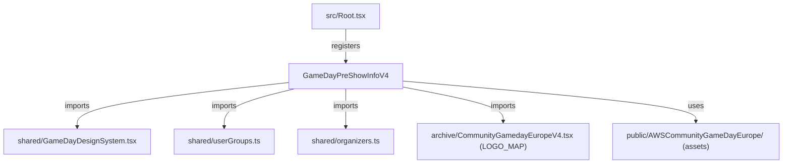

# Design Document: PreShowInfo V4

## Overview

PreShowInfo V4 is a targeted iteration on the existing V3 Remotion composition (`04v3-GameDayStreamPreShowInfo-V3.tsx`). The V4 file (`04v4-GameDayStreamPreShowInfo-V4.tsx`) is a copy of V3 with the following changes:

1. Remove borders from UG spotlight logo containers (keep rounded corners, background, padding)
2. Replace "Event" and "Status" stat boxes with "Country" (flag + name) and "City" in `SlideUGSpotlight`
3. Add UG Leader badge image to `SlideUGLeader`
4. Add AWS Community Hero logo to `SlideCommunityHero`
5. Add AWS Community Builder logo to `SlideCommunityBuilder`
6. Make `SlideCommunityHero` generic (remove Linda's photo, use Hero logo, generic explanation)
7. Tone down Hero emphasis on `SlideMeetLinda` (stream host first, Hero secondary)

The composition is registered in `src/Root.tsx` with the same parameters as V3 (54000 frames, 30fps, 1280×720).

## Architecture

The V4 composition follows the exact same architecture as V3:



All changes are contained within the single V4 composition file plus three new image assets in `public/AWSCommunityGameDayEurope/`. No shared modules are modified.

### Key Design Decisions

1. **Copy, don't refactor**: V4 is a full copy of V3. This keeps V3 stable and avoids shared-state bugs. The 1200-line file is self-contained by design.
2. **City/Country parsing**: The `city` field in `USER_GROUPS` uses the format `"City, Country"`. We split on `", "` to extract city (before comma) and country (after comma). The flag emoji is already available on the UG object.
3. **Generic Hero slide**: Replace Linda's photo + badge with the Hero program logo as the primary visual. Keep the educational bullet points but reword the heading to be program-focused rather than person-focused.
4. **Linda slide reorder**: Move "AWS Community Hero" from the first bullet to a later position or subtitle. Lead with stream host and co-organizer roles.
5. **Asset downloads**: Three images need to be manually downloaded and placed in `public/AWSCommunityGameDayEurope/` before the composition can render. The task list will include download instructions.

## Components and Interfaces

### Modified Components (V4 changes from V3)

#### SlideUGSpotlight
- **Logo container**: Remove `border: 1px solid ${GD_VIOLET}33`. Keep `borderRadius: 20`, `background`, `padding`.
- **Stat boxes**: Replace the 4-stat array:
  - Keep: `Group` → `"N of 57"` with `GD_VIOLET`
  - Keep: `Location` → `city.split(",")[0]` (city name) with `GD_PINK`
  - Replace `Event` → `Country` showing `g.flag + " " + city.split(", ")[1]?.trim()` with `GD_GOLD`
  - Replace `Status` → `City` showing `city.split(",")[0]?.trim()` with `#4ade80`

#### SlideCommunityHero
- Remove Linda photo (``)
- Remove "AWS Hero" badge with Linda's name underneath
- Add Hero logo: ``
- Reword heading from "The highest community recognition" to a generic program description
- Keep the three educational bullet points about Hero categories and recognition

#### SlideMeetLinda
- Reorder bullet points: lead with stream host/co-organizer roles
- Move Hero mention to subtitle or later bullet
- Keep UG Vienna leader, co-organizer, Förderverein info

#### SlideUGLeader
- Add UG Leader badge image: ``
- Display badge alongside or above the existing content with appropriate sizing

#### SlideCommunityBuilder
- Add Community Builder logo: ``
- Display logo alongside or above the existing content with appropriate sizing

### New Assets

| File | Source | Format |
|------|--------|--------|
| `public/AWSCommunityGameDayEurope/ug-leader-badge-dark.png` | Notion: Usergroups-badges_leader-dark | PNG |
| `public/AWSCommunityGameDayEurope/aws-community-hero-logo.svg` | `https://builder.aws.com/assets/Hero_Default_Light-W1mudtFL.svg` | SVG |
| `public/AWSCommunityGameDayEurope/aws-community-builder-logo.png` | `https://d2908q01vomqb2.cloudfront.net/da4b9237bacccdf19c0760cab7aec4a8359010b0/2020/07/23/AWS-CBs-blog-image.png` | PNG |

### Unchanged Components

All other slides (SlideHero, SlideWhatsHappening, SlideMeetAndaJerome, SlideMeetGamemasters, SlideAWSCommunity, SlideCloudClubs, SlideSchedule, SlideHowItWorks, SlideAllOrganizers, SlideGetReady, SlideAudioCheck, SlideStats) remain identical to V3. The `buildSections()` function, transition sequence, TopBar, and all animation helpers are unchanged.

## Data Models

No new data models. The existing types are reused:

- `USER_GROUPS`: `Array<{ flag: string; name: string; city: string }>` — city field parsed as `"City, Country"`
- `ORGANIZERS` / `AWS_SUPPORTERS`: `Organizer[]` from `shared/organizers.ts`
- `LOGO_MAP`: `Record<string, string>` from `archive/CommunityGamedayEuropeV4.tsx`

### City/Country Parsing Logic

```typescript
// Given g.city = "Vienna, Austria"
const cityName = g.city.split(",")[0]?.trim();      // "Vienna"
const countryName = g.city.split(", ")[1]?.trim();   // "Austria"
// g.flag is already the country flag emoji: "🇦🇹"
```


## Correctness Properties

*A property is a characteristic or behavior that should hold true across all valid executions of a system — essentially, a formal statement about what the system should do. Properties serve as the bridge between human-readable specifications and machine-verifiable correctness guarantees.*

Most of the V4 requirements are visual/structural changes (CSS tweaks, image additions, content reordering) that are best verified by example tests or visual inspection. However, the city/country parsing logic introduced in Requirement 3 is a genuine data transformation that applies to all 57 user groups and is well-suited to property-based testing.

### Property 1: City/Country field parsing round-trip

*For any* user group whose `city` field follows the `"CityName, CountryName"` format, splitting on `", "` should produce a non-empty city name (part before the comma) and a non-empty country name (part after the comma), and concatenating them back with `", "` should reproduce the original `city` value.

**Validates: Requirements 3.3, 3.4**

### Property 2: Country extraction matches flag for all user groups

*For any* user group in the `USER_GROUPS` array, the country name extracted from the `city` field (part after `", "`) should be a non-empty string, and the `flag` emoji should be a valid Unicode flag sequence (two regional indicator symbols). This ensures the "Country" stat box always has valid data to display.

**Validates: Requirements 3.3**

## Error Handling

This composition is a Remotion video — there are no runtime user interactions or network calls. Error scenarios are limited to:

1. **Missing logo in LOGO_MAP**: Already handled by V3's `findLogo()` function returning `null`, which falls back to displaying the flag emoji. No change in V4.
2. **City field without comma**: If a `city` field doesn't contain `", "`, the split would produce only one part. The country would be `undefined`. Mitigation: use fallback empty string (`city.split(", ")[1]?.trim() ?? ""`). In practice, all 57 entries in `USER_GROUPS` follow the `"City, Country"` format.
3. **Missing asset files**: If the downloaded images don't exist at the expected paths, Remotion's `staticFile()` will throw at render time. Mitigation: tasks include explicit download/save steps before any rendering.

## Testing Strategy

### Property-Based Tests

Use `fast-check` as the property-based testing library (already available in the project for existing property tests).

- **Property 1** (City/Country parsing): Generate random strings in `"Word, Word"` format and verify the split logic produces correct city and country parts. Also test against the actual `USER_GROUPS` array to ensure all 57 entries parse correctly. Minimum 100 iterations.
- **Property 2** (Country + flag validity): For all entries in `USER_GROUPS`, verify the extracted country is non-empty and the flag is a valid emoji. This is exhaustive over the 57 entries but can also be generalized with generated data.

Each property test must be tagged with:
- **Feature: preshow-info-v4, Property 1: City/Country field parsing round-trip**
- **Feature: preshow-info-v4, Property 2: Country extraction matches flag for all user groups**

Configuration: minimum 100 iterations per property test.

### Unit Tests (Examples)

Unit tests should cover the specific example-based acceptance criteria:

- V4 file exports `GameDayPreShowInfoV4` component
- `SlideUGSpotlight` stat array contains "Group", "Location", "Country", "City" (and NOT "Event", "Status")
- `SlideMeetLinda` first bullet point does not contain "highest recognition tier"
- `SlideMeetLinda` retains UG Vienna leader, co-organizer, Förderverein references
- `SlideCommunityHero` does not reference Linda's face image path
- `SlideCommunityHero` references the Hero logo SVG path

### Visual Verification

The following should be verified by rendering screenshots at key frames:
- UG spotlight logo containers have no visible border
- UG Leader badge, Hero logo, and Builder logo display at appropriate sizes
- Linda slide reads as "stream host first, Hero second"
- Hero slide shows program logo instead of Linda's photo

Each property-based test must be implemented as a single test using `fast-check`'s `fc.assert(fc.property(...))` pattern, referencing the design property number in a comment tag.
