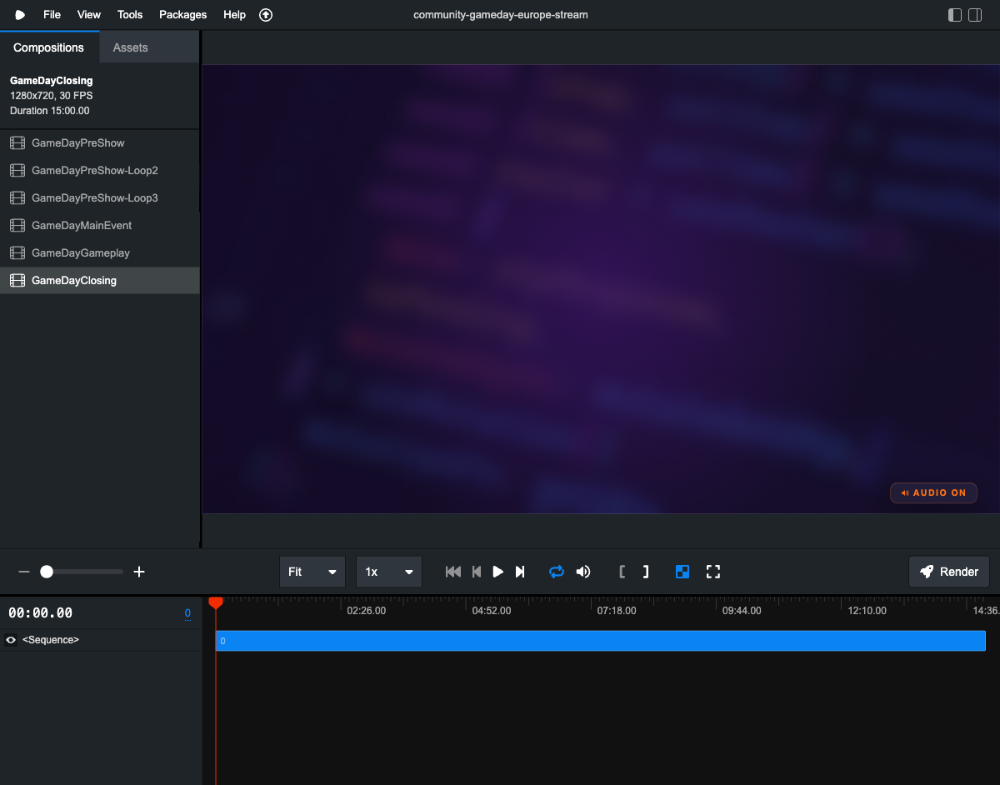
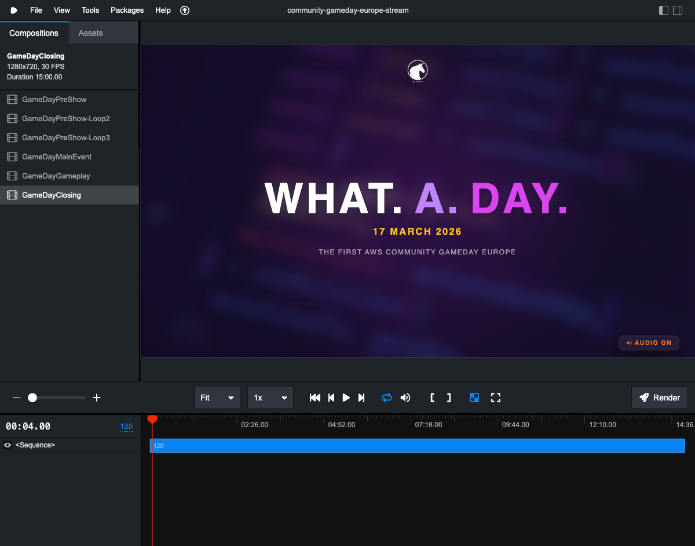
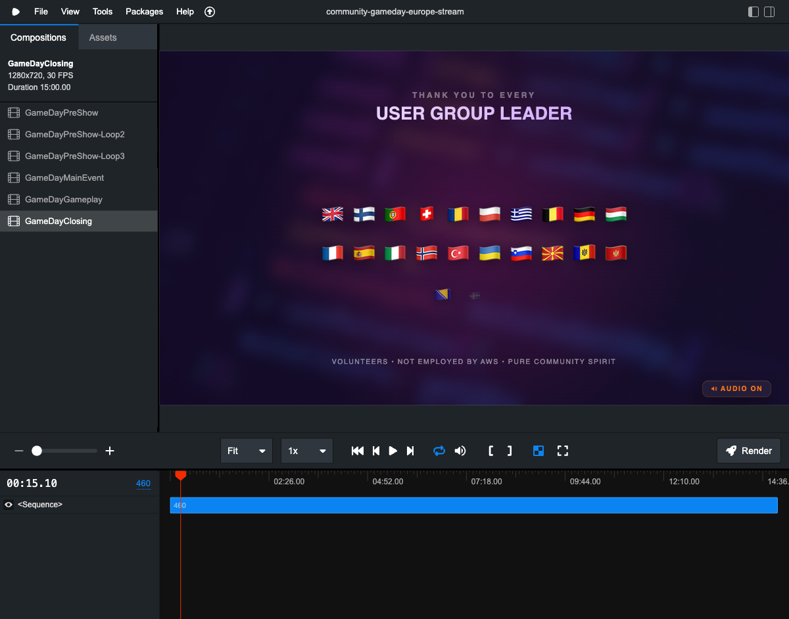
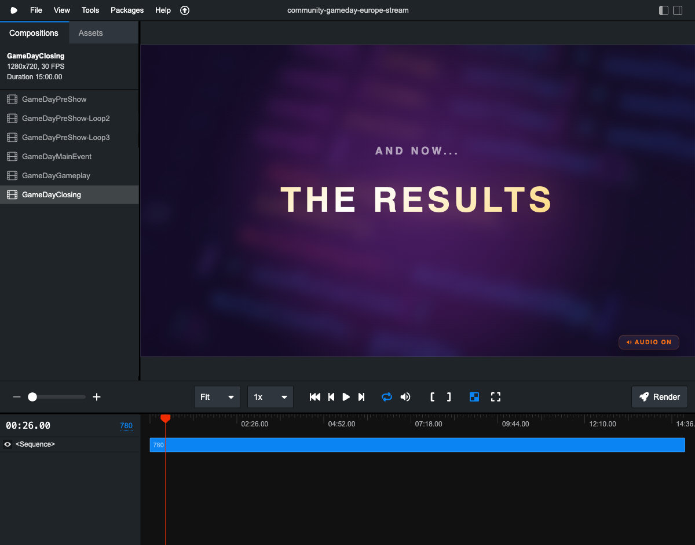
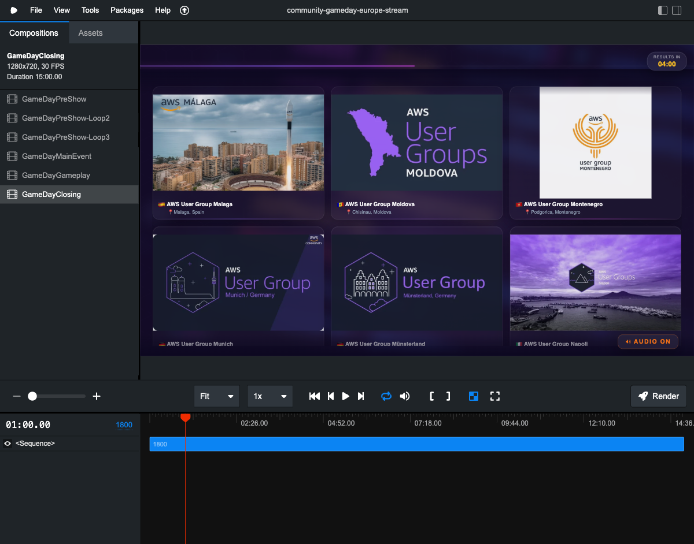
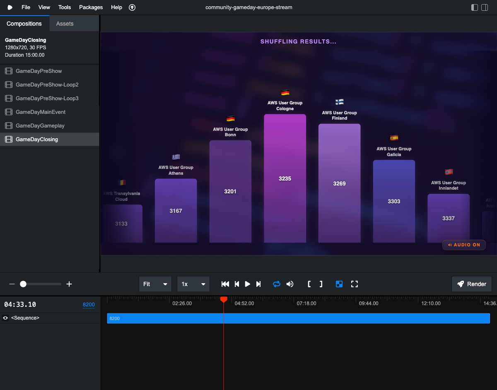
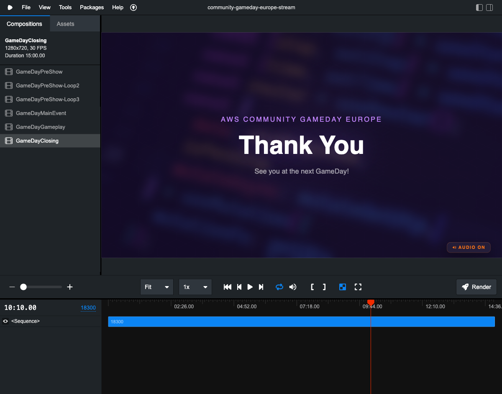
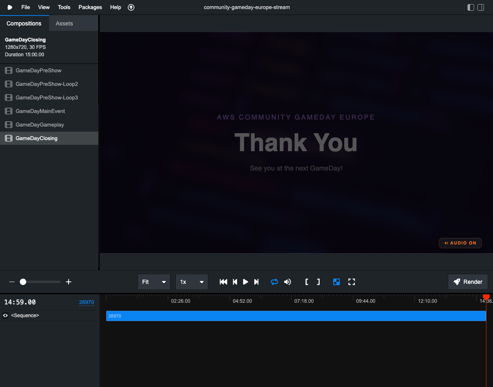

# AWS Community GameDay Europe — Stream Visuals

Remotion-powered stream overlay compositions for the first-ever **AWS Community GameDay Europe**, a competitive cloud event spanning **53+ AWS User Groups** across **20+ countries** and multiple timezones.

These compositions are the visual layer of a live stream that plays at every participating User Group location simultaneously. They provide countdowns, schedules, speaker information, and key instructions — ensuring every attendee can follow along even with bad audio or no idea who is on screen.

## Preview

### Hero Intro


### Hero Scenes




### Fast Scroll Showcase


### Shuffle Phase


### Thank You


### Fade to Black


---

## What is this?

This repository contains **4 Remotion video compositions** that together form the full ~3-hour GameDay stream experience:

| # | Composition | File | Duration | Purpose |
|---|-------------|------|----------|---------|
| 0 | **Pre-Show** | `00-GameDayStreamPreShow-Muted.tsx` | 10 min (loop ×3 = 30 min) | Countdown loop before the stream goes live |
| 1 | **Main Event** | `01-GameDayStreamMainEvent-Audio.tsx` | 30 min | Live introductions, instructions, code distribution |
| 2 | **Gameplay** | `02-GameDayStreamGameplay-Muted.tsx` | 120 min | Muted overlay during the 2-hour game |
| 3 | **Closing** | `03-GameDayStreamClosing-Audio.tsx` | 15 min | Winner ceremony, local awards, and wrap-up |

Additional files:
- `shared/GameDayDesignSystem.tsx` — Shared colors, components, springs, and timing constants
- `archive/` — Earlier iterations (V1–V4) of the community promo video + the original stream overlay, kept as reference

## What is Remotion?

[Remotion](https://www.remotion.dev/) is a framework for creating videos programmatically using React. Instead of editing in a video tool, you write React components that render frame-by-frame. This gives you:

- **Pixel-perfect control** over every element at every frame
- **Data-driven visuals** — countdowns, schedules, and speaker info come from code
- **Remotion Studio** — a browser-based preview where you can scrub through the timeline, inspect frames, and see chapter markers
- **Rendering** — export to MP4/WebM at any resolution

You don't need video editing experience. If you know React, you can read and modify these compositions.

## Quick Start

### Prerequisites

- **Node.js** 18+ (recommended: 20 LTS)
- **npm** or **pnpm**
- A modern browser (Chrome recommended for Remotion Studio)

### Installation

This repo is a complete Remotion project — everything you need is included.

```bash
# 1. Clone the repo
git clone <repo-url>
cd community-gameday-europe-stream

# 2. Install dependencies
npm install

# 3. Start Remotion Studio
npx remotion studio
```

That's it. Open `http://localhost:3000` in your browser and you'll see all compositions listed on the left.

### Using Remotion Studio

Once running, open `http://localhost:3000` in your browser. You will see:

- A **composition list** on the left — click any composition to preview it
- A **timeline** at the bottom — scrub to any frame, see chapter markers
- **Play/pause** controls — watch the composition in real-time
- **Frame counter** — jump to specific frames (e.g., frame 1800 = 1 minute mark)

Useful keyboard shortcuts:
- `Space` — Play/Pause
- `←` / `→` — Step one frame back/forward
- `J` / `L` — Slow down / speed up playback
- `Home` / `End` — Jump to start/end

### Rendering to Video

```bash
# Render a specific composition to MP4
npx remotion render GameDayMainEvent out/main-event.mp4

# Render at specific frame range (e.g., just the intro)
npx remotion render GameDayMainEvent out/intro-only.mp4 --frames=0-1799
```

## Project Structure

```
├── package.json                              # Dependencies (remotion, react)
├── tsconfig.json                             # TypeScript config
├── remotion.config.ts                        # Remotion entry point config
├── src/
│   ├── Root.tsx                              # Composition registry (imports all 4 compositions)
│   └── index.ts                              # Remotion entry point
├── 00-GameDayStreamPreShow-Muted.tsx         # 0. Pre-Show countdown loop (muted)
├── 01-GameDayStreamMainEvent-Audio.tsx       # 1. Main Event — live intros (audio)
├── 02-GameDayStreamGameplay-Muted.tsx        # 2. Gameplay — 2h overlay (muted)
├── 03-GameDayStreamClosing-Audio.tsx         # 3. Closing Ceremony (audio)
├── shared/
│   └── GameDayDesignSystem.tsx               # Colors, components, springs, timing
├── public/
│   └── AWSCommunityGameDayEurope/            # Logos, backgrounds, speaker avatars
├── screenshots/                              # Frame captures for reference / debugging
├── __tests__/                                # Property-based tests
├── docs/                                     # Detailed per-composition documentation
├── archive/                                  # Earlier iterations (V1–V4), kept as reference
└── README.md                                 # This file
```

## Main Event Schedule (Source of Truth)

The Main Event composition (30 min) follows this exact schedule:

| Time (CET) | Segment | Duration | Who |
|-------------|---------|----------|-----|
| 18:00–18:01 | Linda — Welcome & Intro | 1 min | Linda Mohamed |
| 18:01–18:05 | Jerome & Anda — Community GameDay | ~4 min | Jerome & Anda |
| 18:05–18:06 | Linda — Transition | ~1 min | Linda Mohamed |
| 18:06–18:07 | Support Process Video | 1 min | — |
| 18:07–18:13 | Special Guest | 6 min | — (surprise) |
| 18:13–18:14 | AWS Gamemasters Intro | 1 min | — |
| 18:14–18:25 | GameDay Instructions | 11 min | Arnaud & Loïc |
| 18:25–18:30 | Distribute Codes | 5 min | — |

## Gameplay Key Moments

| Time (CET) | What Happens |
|-------------|-------------|
| 18:30 | Game starts — stream muted, gameplay overlay active |
| 19:30 | Half-time — leaderboard shown, QR code for self-check |
| 19:45–20:00 | Survey quest unhidden (5000 bonus points) |
| 20:30 | Game ends — closing ceremony begins |

## Closing Ceremony

| Time (CET) | What Happens |
|-------------|-------------|
| 20:30 | Global winner announcement (slides only, not on camera) |
| 20:30–21:00 | Local winner ceremonies — UG leaders hand out medals and take photos |
| 21:00 | Stream ends with music |

Note: Global top 3 winners are announced via slides (not shown on camera) due to local setup limitations. Local UG leaders handle their own award ceremonies.

## Design System

All compositions share a unified design system (`shared/GameDayDesignSystem.tsx`):

**Colors:**
| Name | Hex | Usage |
|------|-----|-------|
| `GD_DARK` | `#0c0820` | Background |
| `GD_PURPLE` | `#6c3fa0` | Hex grid, subtle accents |
| `GD_VIOLET` | `#8b5cf6` | Active states, speaker glow |
| `GD_PINK` | `#d946ef` | Highlights, urgency |
| `GD_ACCENT` | `#c084fc` | Labels, secondary text |
| `GD_ORANGE` | `#f97316` | Warnings, final countdown |
| `GD_GOLD` | `#fbbf24` | Closing ceremony, celebration |

**Shared Components:**
- `BackgroundLayer` — Dark gradient over the landscape image
- `HexGridOverlay` — Subtle hexagonal grid pattern
- `GlassCard` — Frosted-glass card with blur, border, and shadow
- `AudioBadge` — Muted/unmuted indicator (bottom-right)

**Animation Presets:**
- `springConfig.entry` — Smooth element entrance
- `springConfig.exit` — Gentle element exit
- `springConfig.emphasis` — Bouncy attention-grabbing
- `staggeredEntry()` — Delays for sequential element reveals

**Timing Constants:**
- `FPS = 30` — All compositions run at 30 fps
- `MIN = 1800` — Frames per minute
- Event timeline offsets: `EVENT_START`, `STREAM_START`, `GAME_START`, `GAME_END`, `EVENT_END`

## Event Timeline (CET Reference)

The event spans 4+ timezones across Europe. All times below are CET — local times vary by city. The compositions use frame-based countdowns that are timezone-independent.

```
17:30  EVENT_START     — Pre-Show begins (optional, local UG setup)
       17:30–17:50     Countdown + basic info (teams forming, schedule)
       17:50–18:00     Countdown to stream start + audio reminder
18:00  STREAM_START    — Live stream begins, Main Event composition
       18:00–18:06     Community Intro (Linda, Jerome & Anda)
       18:06–18:07     Support Process video
       18:07–18:13     Special Guest (surprise)
       18:13–18:14     AWS Gamemasters Intro
       18:14–18:25     GameDay Instructions (Arnaud & Loïc)
       18:25–18:30     Distribute team codes
18:30  GAME_START      — Gameplay begins (stream muted)
       19:30           Half-time (leaderboard shown)
       19:45–20:00     Survey quest unhidden (5000 points)
20:30  GAME_END        — Closing Ceremony begins (audio back on)
       20:30–21:00     Global winners, local ceremonies, wrap-up
21:00  EVENT_END       — Stream ends with music
```

## The People

- **Linda Mohamed** — Stream Host, AWS Community Hero, AWS & Women's UG Vienna
- **Jerome** — Co-organizer, AWS User Group Belgium (Brussels)
- **Anda** — Co-organizer, AWS User Group Geneva
- **Jeff Barr** — Special Guest
- **Arnaud & Loïc** — AWS Gamemasters (gameplay instructions)

## For the Community

This project was built entirely by community volunteers. If you want to understand how the stream visuals work, modify them for your own event, or learn Remotion — you are welcome to explore, fork, and adapt.

See the `docs/` folder for detailed breakdowns of each composition.

## License

Community project — built by volunteers for the AWS Community GameDay Europe 2025.
