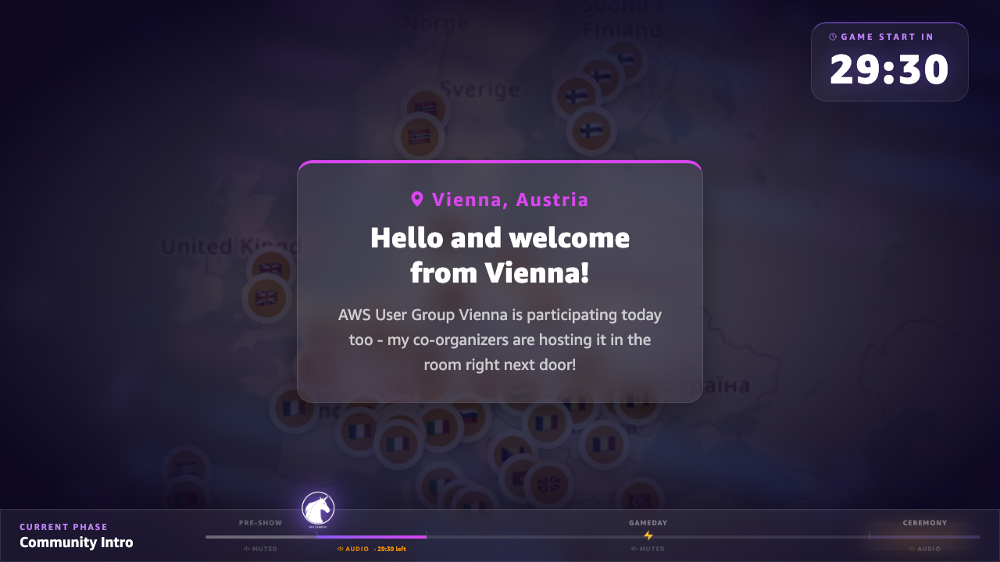
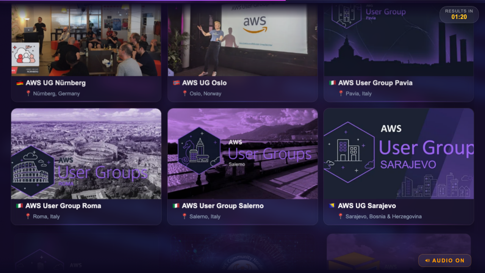
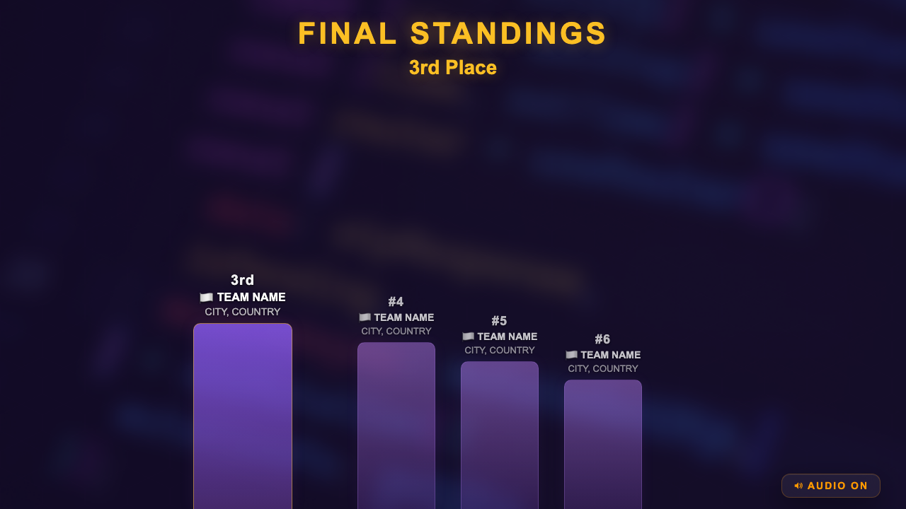

# AWS Community GameDay Europe — Stream Visuals

> **LIVE WINNERS TEMPLATE** — The closing ceremony winners must be updated with real data before rendering. See **[TEMPLATE.md](TEMPLATE.md)** for instructions.

Remotion-powered stream overlay compositions for the first-ever **AWS Community GameDay Europe**, a competitive cloud event spanning **53+ AWS User Groups** across **20+ countries** and multiple timezones.

These compositions are the visual layer of a live stream that plays at every participating User Group location simultaneously. They provide countdowns, schedules, speaker information, and key instructions — ensuring every attendee can follow along even with bad audio or no idea who is on screen.

---

## Preview

### Pre-Show Info Loop


### Main Event — Speaker & Schedule


### Gameplay Overlay


### Closing — Shuffle Phase (Part A)


### Closing — Bar Chart Reveal (Part B)


### Live Inserts — Commentary & Operations


---

## What is this?

This repository contains Remotion video compositions (in `src/compositions/`) that together form the full ~3-hour GameDay stream experience. The compositions cover every phase of the event — from the pre-show countdown through the final winner reveal — plus a library of 29 live **insert** compositions for in-game announcements.

See [docs/remotion.md](docs/remotion.md) for a complete visual reference of every composition with screenshots, rendering commands, and the full Remotion developer guide.

---

## Compositions

### Main stream (in order)

| Composition ID | File | Duration | Purpose |
|----------------|------|----------|---------|
| `00-Countdown` | `00-preshow/Countdown.tsx` | 10 min (loop) | Simple countdown timer before stream |
| `00-InfoLoop` | `00-preshow/InfoLoop.tsx` | 30 min | Rotating content: user groups, organizers, schedule |
| `01-MainEvent` | `01-main-event/MainEvent.tsx` | 30 min | Live introductions, speaker info, code distribution |
| `02-Gameplay` | `02-gameplay/Gameplay.tsx` | 120 min | Muted overlay during the 2-hour game |
| `03A-ClosingPreRendered` | `03-closing/ClosingPreRendered.tsx` | ~2.5 min | Hero intro, fast scroll, shuffle — pre-rendered |
| `03B-ClosingWinnersTemplate` | `03-closing/ClosingWinnersTemplate.tsx` | ~5 min | Bar chart reveal, podium, thank you — **updated live** |
| `Marketing-OrganizersVideo` | `marketing/MarketingVideo.tsx` | 15 sec | Social media clip for organizers |

### Live inserts (29 total)

30-second full-screen announcements triggered on demand during gameplay. See [docs/playbook.md](docs/playbook.md) for when and how to use each one.

| Category | Inserts |
|----------|---------|
| **Event Flow** | `Insert-QuestsLive`, `Insert-HalfTime`, `Insert-FinalCountdown`, `Insert-GameExtended`, `Insert-LeaderboardHidden`, `Insert-ScoresCalculating`, `Insert-BreakAnnouncement`, `Insert-WelcomeBack` |
| **Live Commentary** | `Insert-FirstCompletion`, `Insert-CloseRace`, `Insert-ComebackAlert`, `Insert-TopTeams`, `Insert-CollectiveMilestone`, `Insert-TeamSpotlight` |
| **Quest Operations** | `Insert-QuestFixed`, `Insert-QuestBroken`, `Insert-QuestUpdate`, `Insert-QuestHint`, `Insert-NewQuestAvailable`, `Insert-SurveyReminder` |
| **Operational** | `Insert-StreamInterruption`, `Insert-TechnicalIssue`, `Insert-Leaderboard`, `Insert-ScoreCorrection`, `Insert-GamemastersUpdate` |
| **People & Community** | `Insert-StreamHostUpdate`, `Insert-LocationShoutout`, `Insert-ImportantReminder` |

Full visual reference with screenshots: [docs/remotion.md](docs/remotion.md)

---

## Quick Start

### Prerequisites

- **Node.js** 18+ (recommended: 20 LTS)
- **npm**
- A modern browser (Chrome recommended for Remotion Studio)

### Installation

```bash
git clone <repo-url>
cd community-gameday-europe-stream
npm install
npm run studio
```

Open `http://localhost:3000`. All 35 compositions appear in the left sidebar.

### Render a composition

```bash
# Render to video
npx remotion render src/index.ts 01-MainEvent out/main-event.mp4

# Render a single frame (for preview/docs)
npx remotion still src/index.ts Insert-CloseRace out/preview.png --frame=90

# Render an insert for use in a video switcher
npx remotion render src/index.ts Insert-QuestsLive out/quests-live.mp4
```

Video files are gitignored — render locally, never commit.

---

## Project Structure

```
├── config/
│   ├── event.ts              # Event metadata and timezone
│   ├── schedule.ts           # Timeline segments for MainEvent
│   ├── participants.ts       # Organizers, AWS supporters, user groups
│   └── logos.ts              # User group logo URLs (loaded from Notion CDN)
│
├── src/
│   ├── Root.tsx              # All 35 compositions registered here
│   ├── index.ts              # Remotion entry point
│   ├── design/               # Colors, typography, animation presets
│   ├── components/           # Shared UI (BackgroundLayer, GlassCard, etc.)
│   ├── utils/                # Timing, phases, closing ceremony logic
│   └── compositions/
│       ├── 00-preshow/       # Countdown + InfoLoop
│       ├── 01-main-event/    # MainEvent
│       ├── 02-gameplay/      # Gameplay overlay
│       ├── 03-closing/       # ClosingPreRendered + ClosingWinnersTemplate
│       ├── marketing/        # MarketingVideo
│       └── inserts/
│           ├── _TEMPLATE.tsx # Copy this to create a new insert
│           ├── event-flow/   # Phase markers (kickoff, halftime, etc.)
│           ├── commentary/   # Narrative moments (first completion, close race, etc.)
│           ├── quest/        # Quest status updates
│           ├── ops/          # Operational announcements
│           └── people/       # Community moments
│
├── public/
│   └── assets/
│       ├── faces/            # Face photos — firstname.jpg (all lowercase)
│       ├── logos/            # GameDay logo variants
│       ├── aws-community-logo.png
│       ├── aws-usergroups-badge.png
│       ├── aws-builders-logo.png
│       ├── aws-heroes-logo.png
│       ├── aws-cloud-clubs-logo.png
│       ├── background-landscape.png
│       ├── europe-map.png
│       └── gameday-unicorn.png
│
├── docs/
│   ├── remotion.md           # Full Remotion developer guide with all composition screenshots
│   ├── playbook.md           # Stream operator guide — when and how to use inserts
│   ├── inserts.md            # Insert design rules and contributor guide
│   └── stream-preview/       # Timeline screenshots from the actual event
│
└── screenshots/
    └── readme-*.png          # Composition screenshots used in documentation
```

---

## Design System

All compositions share a unified design system in `src/design/`. See [src/design/README.md](src/design/README.md) for the full reference.

**Colors** (`src/design/colors.ts`):

| Name | Hex | Usage |
|------|-----|-------|
| `GD_DARK` | `#0c0820` | Background base |
| `GD_PURPLE` | `#6c3fa0` | Hex grid, subtle accents |
| `GD_VIOLET` | `#8b5cf6` | Community moments, people inserts |
| `GD_ACCENT` | `#c084fc` | Labels, commentary inserts |
| `GD_ORANGE` | `#ff9900` | AWS/Gamemaster announcements, warnings |
| `GD_GOLD` | `#fbbf24` | Event flow milestones |
| `GD_GREEN` | `#22c55e` | Quest fixed / success |
| `GD_RED` | `#ef4444` | Quest broken / technical issues |

**Animation presets** (`src/design/animations.ts`):

| Preset | damping | stiffness | Usage |
|--------|---------|-----------|-------|
| `springConfig.entry` | 14 | 120 | Standard element entrance |
| `springConfig.emphasis` | 8 | 200 | Punchy, attention-grabbing |
| `springConfig.exit` | 20 | 100 | Gentle element exit |

---

## Event Timeline (CET Reference)

```
17:30  Pre-Show begins (optional local UG setup)
18:00  Stream starts — Main Event composition
       18:00–18:06  Community intro (Linda, Jerome & Anda)
       18:06–18:07  Support process video
       18:07–18:13  Special guest
       18:13–18:14  AWS Gamemasters intro
       18:14–18:25  GameDay instructions (Arnaud & Loïc)
       18:25–18:30  Distribute team codes
18:30  Game starts — Gameplay overlay (stream muted)
19:30  Half-time — leaderboard shown
20:30  Game ends — Closing ceremony begins (audio back on)
21:00  Stream ends
```

---

## User Group Logos

The 53+ user group logos are not stored locally — they load at render time from a shared Notion database. The URL mapping lives in `config/logos.ts`.

[](https://awscommunitydach.notion.site/89ae998ccfc941f8a4ebf3e7b6586045?v=11f535253b02470f963a6d844ca671d4)
> Click to open the public Notion gallery.

Rendering requires internet access. If a logo URL is unreachable, a flag-only card is shown as fallback.

---

## Closing Ceremony

Split into two compositions for live flexibility:

- **`03A-ClosingPreRendered`** — Pre-render this before the event. Hero intro showcasing all user groups, fast scroll, shuffle countdown building suspense.
- **`03B-ClosingWinnersTemplate`** — Updated live with real scores. Bar chart reveal (6th → 1st), podium cards, thank you. See [TEMPLATE.md](TEMPLATE.md).

---

## For the Community

This project was built entirely by community volunteers for **AWS Community GameDay Europe 2026** (March 17, 2026 — first edition). If you want to understand how the stream visuals work, adapt them for your own event, or learn Remotion — you are welcome to explore, fork, and adapt.

See [AGENTS.md](AGENTS.md) for architecture guidance and [CONTRIBUTING.md](CONTRIBUTING.md) for how to adapt and contribute back.

## License

[CC BY-NC-SA 4.0](LICENSE) — Non-commercial community use only. Built by volunteers for the AWS Community GameDay Europe 2026.
