# Remotion — Developer Guide

This project uses [Remotion](https://www.remotion.dev/) to build video compositions as React components. Every visual on the stream  — from the pre-show loop to the winners reveal and all 29 live inserts — is a Remotion composition.

---

## What is Remotion?

Remotion treats video as code. Each composition is a React component that receives a `frame` number as input and renders a single image. String those frames together and you get video.

Key concepts:

- `useCurrentFrame()` — returns the current frame number (0-indexed). Every animation is derived from this.
- `useVideoConfig()` — returns `fps`, `width`, `height`, `durationInFrames`.
- `spring()` — physics-based interpolation, used for entry animations throughout this project.
- `interpolate()` — maps a value from one range to another (e.g., frame 0–30 → opacity 0–1).
- `staticFile()` — resolves paths in `public/` to usable URLs. Always use this for images and videos.
- `Img` — Remotion's image component. Use it instead of `` so frames load synchronously.
- `AbsoluteFill` — a full-size absolute div wrapper. Used for layered compositions.

---

## Remotion Studio

Remotion Studio is the live development environment. It lets you scrub through any composition frame by frame.

```bash
npm run studio
```

Opens at `http://localhost:3000`.

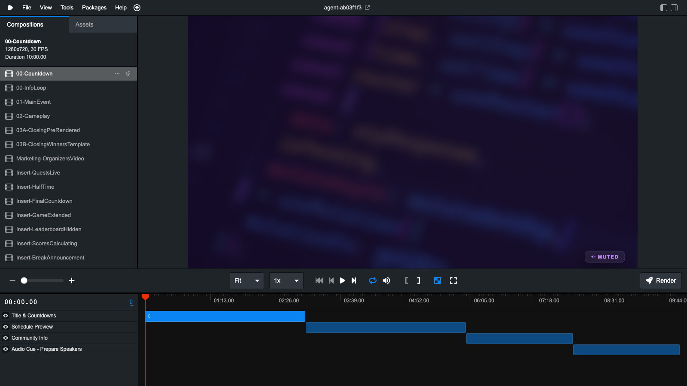

The left sidebar lists every registered composition. The center shows a live preview. The bottom timeline lets you scrub to any frame. The **Render** button in the top-right exports the composition to a file.

### Viewing an insert

All inserts appear in the sidebar prefixed with `Insert-`. Selecting one shows a 30-second composition (900 frames at 30fps).


To update live data for an insert, edit the variables at the top of the `.tsx` file and save. Remotion hot-reloads instantly.

---

## Rendering

### Render a single frame (still)

```bash
npx remotion still src/index.ts <CompositionId> output.png --frame=<n>
```

Example:
```bash
npx remotion still src/index.ts Insert-CloseRace screenshots/preview.png --frame=90
```

### Render a full video

```bash
npx remotion render src/index.ts <CompositionId> output.mp4
```

Pre-render inserts ahead of time for use in a video switcher:
```bash
npx remotion render src/index.ts Insert-QuestsLive out/insert-quests-live.mp4
```

Video files are excluded from git (see `.gitignore`). Render locally, play from your video switcher.

---

## Composition overview

All compositions are registered in `src/Root.tsx`.

### Pre-Event

| ID | Duration | Purpose |
|----|----------|---------|
| `00-Countdown` | 10 min (loop) | Simple countdown timer before the stream |
| `00-InfoLoop` | 30 min | Rotating content: user groups, organizers, schedule |


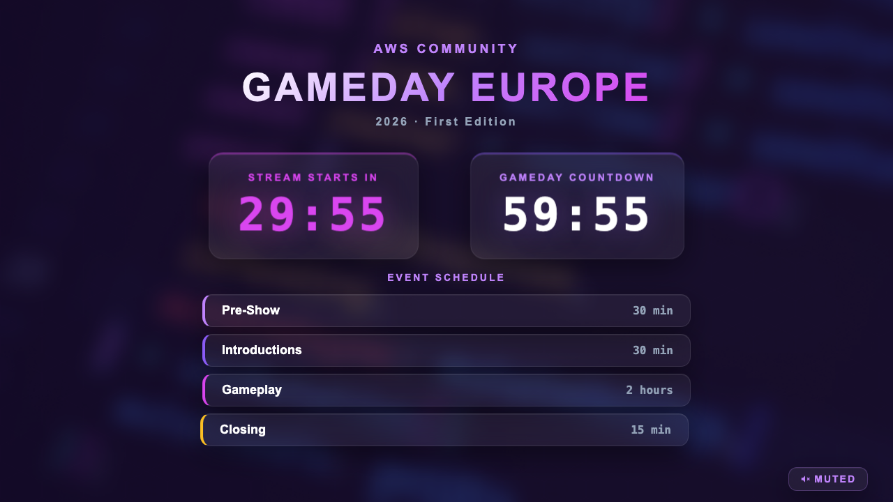

### Live Event

| ID | Duration | Purpose |
|----|----------|---------|
| `01-MainEvent` | 30 min | Introductions, speaker info, code distribution |
| `02-Gameplay` | 120 min | Muted overlay during the 2-hour game |


### Closing

| ID | Duration | Purpose |
|----|----------|---------|
| `03A-ClosingPreRendered` | ~2.5 min | Hero intro, fast scroll, shuffle countdown — pre-rendered before the event |
| `03B-ClosingWinnersTemplate` | ~5 min | Bar chart reveal, podium, thank you — **updated live with real scores** |


> See [TEMPLATE.md](../TEMPLATE.md) for instructions on filling in real scores before rendering the winners.

### Marketing

| ID | Duration | Purpose |
|----|----------|---------|
| `Marketing-OrganizersVideo` | 15 sec | Social media clip for organizers |

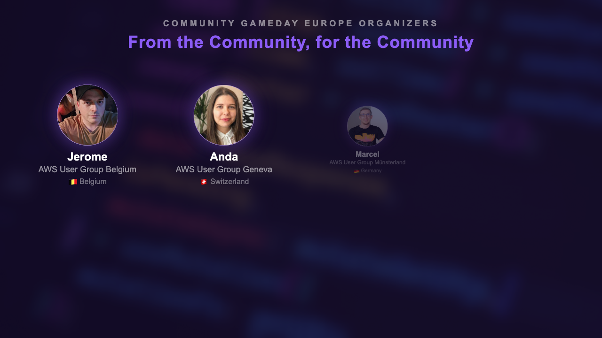

---

## Insert compositions

Inserts are 30-second full-screen announcements for live use during gameplay. They are triggered on demand — not automated. See [playbook.md](playbook.md) for when to use each one.

All inserts are **900 frames at 30fps** (30 seconds). Each has 1–3 configurable variables at the top of its file.

### Event Flow

| ID | Preview |
|----|---------|
| `Insert-QuestsLive` | 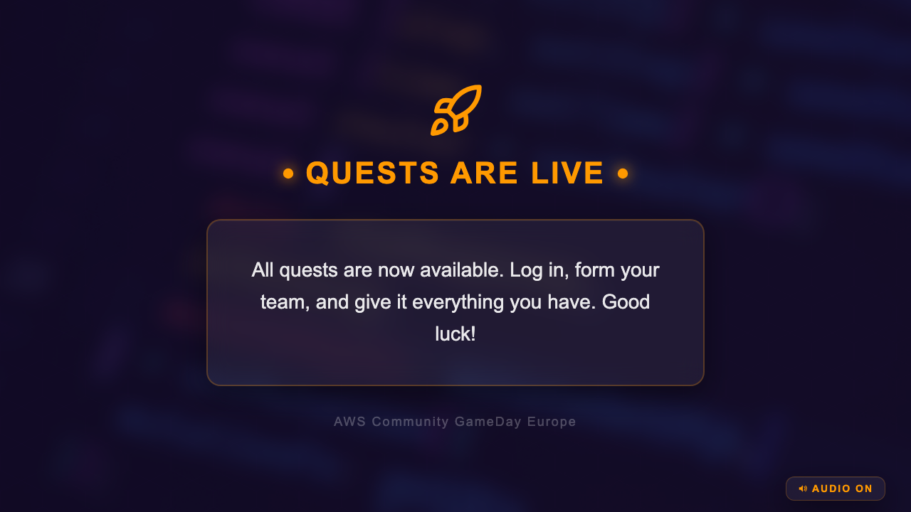 |
| `Insert-HalfTime` |  |
| `Insert-FinalCountdown` | 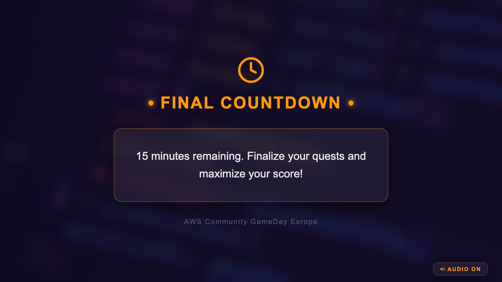 |
| `Insert-GameExtended` | 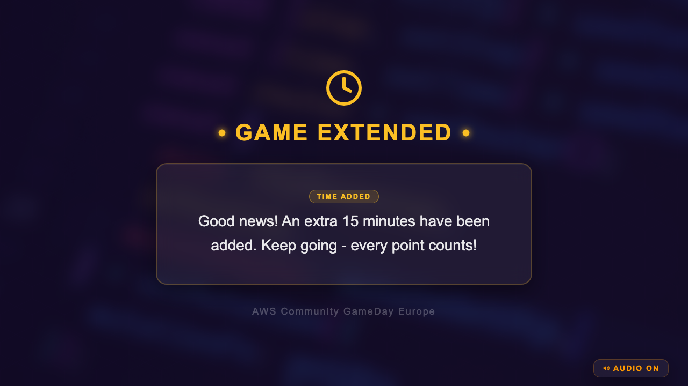 |
| `Insert-LeaderboardHidden` |  |
| `Insert-ScoresCalculating` | 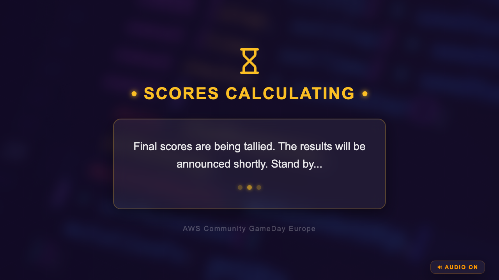 |
| `Insert-BreakAnnouncement` |  |
| `Insert-WelcomeBack` | 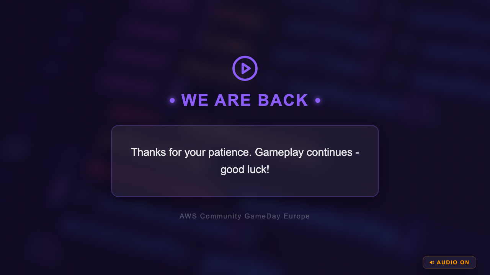 |

### Live Commentary

| ID | Preview |
|----|---------|
| `Insert-FirstCompletion` | 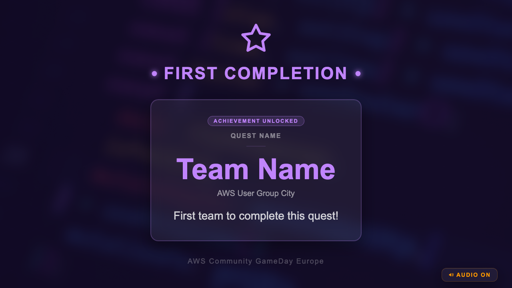 |
| `Insert-CloseRace` |  |
| `Insert-ComebackAlert` | 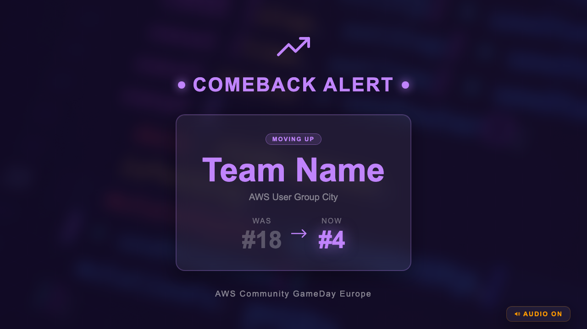 |
| `Insert-TopTeams` | 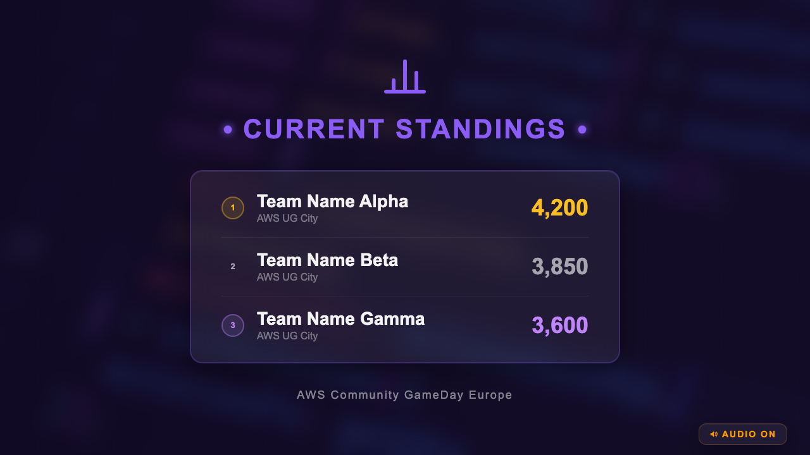 |
| `Insert-CollectiveMilestone` |  |
| `Insert-TeamSpotlight` |  |

### Quest Operations

| ID | Preview |
|----|---------|
| `Insert-QuestFixed` |  |
| `Insert-QuestBroken` |  |
| `Insert-QuestUpdate` |  |
| `Insert-QuestHint` |  |
| `Insert-NewQuestAvailable` |  |
| `Insert-SurveyReminder` |  |

### Operational

| ID | Preview |
|----|---------|
| `Insert-StreamInterruption` |  |
| `Insert-TechnicalIssue` | 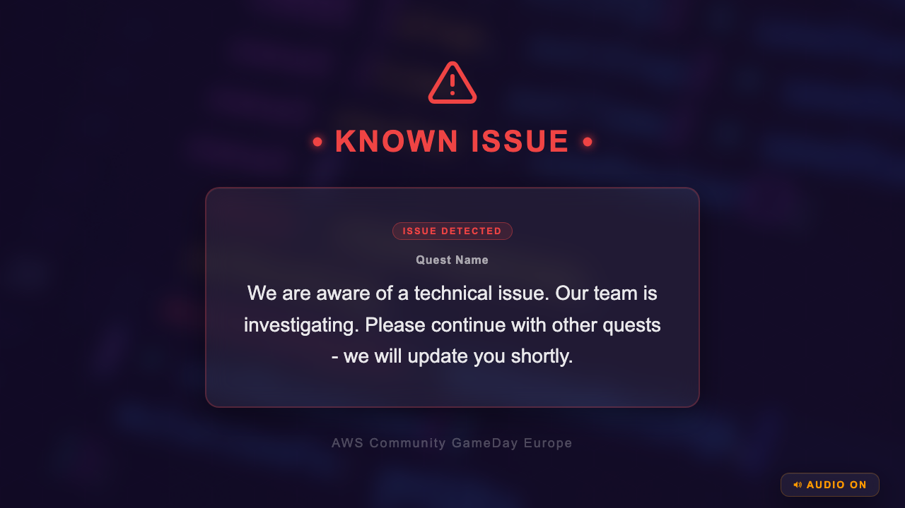 |
| `Insert-Leaderboard` | 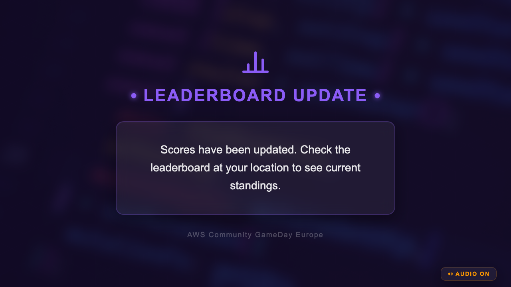 |
| `Insert-ScoreCorrection` |  |
| `Insert-GamemastersUpdate` |  |

### People & Community

| ID | Preview |
|----|---------|
| `Insert-StreamHostUpdate` | 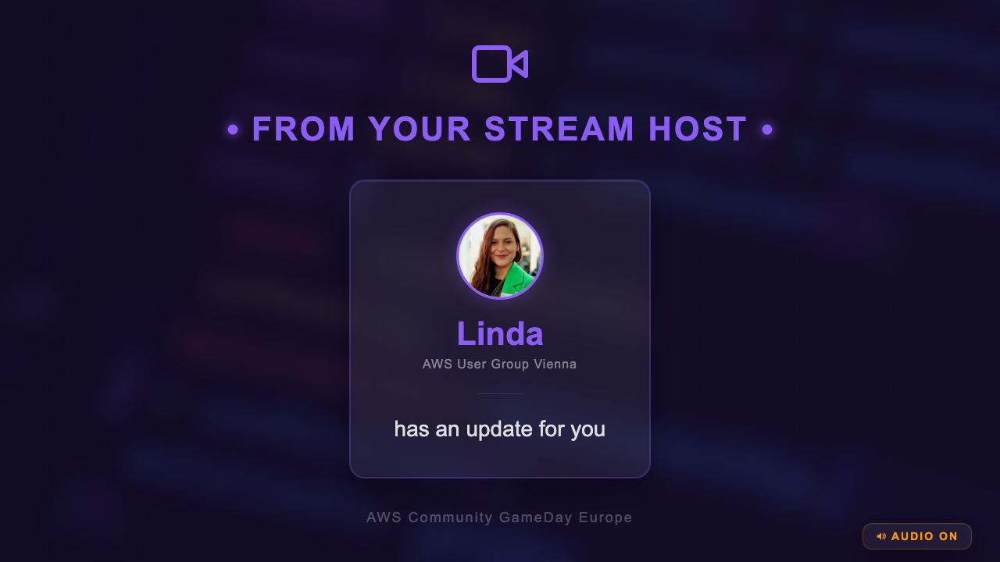 |
| `Insert-LocationShoutout` |  |
| `Insert-ImportantReminder` | 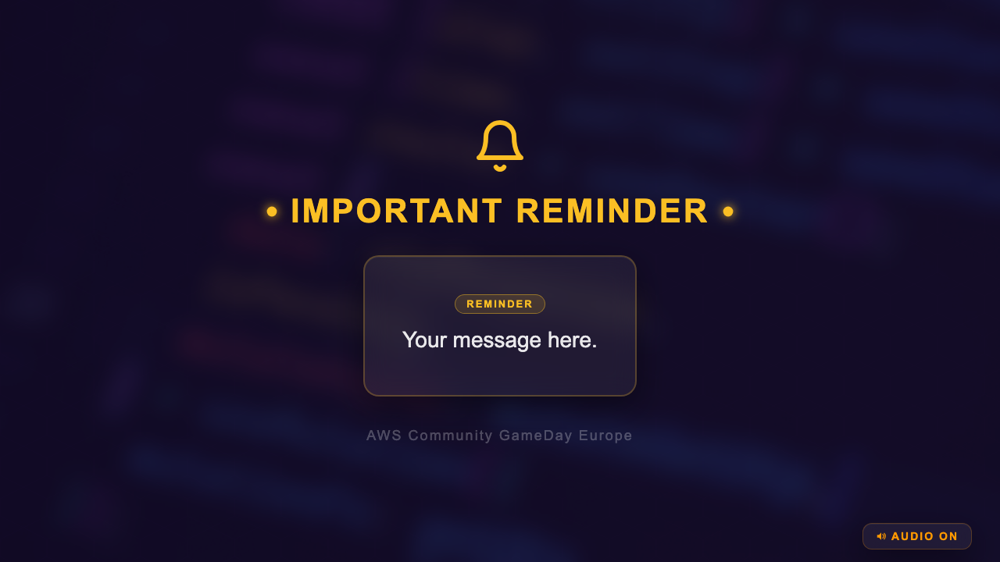 |

---

## Web player

The `web-player/` directory contains a standalone web player built with Remotion's `@remotion/player` package. It embeds selected compositions in a browser-based player — useful for sharing previews without requiring the full Remotion Studio setup.

### Running the web player

```bash
cd web-player
npm install
npm run dev     # development server
npm run build   # production build
```

The web player opens at `http://localhost:5173` (Vite default port).

### How it works

`web-player/src/App.tsx` imports compositions from the main project and wraps them in a `<Player>` component:

```tsx
import { Player } from "@remotion/player";
import { InfoLoop } from "../../src/compositions/00-preshow/InfoLoop";

<Player
  component={InfoLoop}
  durationInFrames={54000}
  compositionWidth={1280}
  compositionHeight={720}
  fps={30}
  controls
/>
```

The player renders in real-time in the browser — no pre-rendering required. Useful for preview and review sessions with stakeholders who don't have Remotion installed.

---

## Project structure

```
src/
├── Root.tsx                     # All compositions registered here
├── index.ts                     # Entry point
├── compositions/
│   ├── 00-preshow/              # Pre-event compositions
│   ├── 01-main-event/           # Main event composition
│   ├── 02-gameplay/             # Gameplay overlay
│   ├── 03-closing/              # Closing ceremony
│   ├── marketing/               # Social media clip
│   └── inserts/                 # 29 live broadcast inserts
│       ├── event-flow/          # Phase markers
│       ├── commentary/          # Narrative moments
│       ├── quest/               # Quest status
│       ├── ops/                 # Operational announcements
│       └── people/              # Community moments
├── components/                  # Shared React components
├── design/                      # Colors, typography, animation constants
├── utils/                       # Shared utility functions
└── config/
    └── participants.ts          # All people data (organizers, AWS staff, user groups)

public/
└── assets/
    ├── faces/                   # Face photos (firstname.jpg)
    ├── logos/                   # GameDay logos
    ├── aws-community-logo.png
    ├── aws-usergroups-badge.png
    ├── aws-builders-logo.png
    ├── aws-heroes-logo.png
    ├── aws-cloud-clubs-logo.png
    ├── background-landscape.png
    ├── europe-map.png
    └── gameday-unicorn.png
```

---

## Adding a new composition

1. Create a `.tsx` file in the appropriate folder under `src/compositions/`
2. Export a React component that uses `useCurrentFrame()` and `useVideoConfig()`
3. Register it in `src/Root.tsx` with a `<Composition>` element
4. It will immediately appear in Remotion Studio

For inserts specifically, use the template in `src/compositions/inserts/_TEMPLATE.tsx`.

---

## Performance tips

- Use `spring()` with `config: { damping: 14, stiffness: 120 }` for smooth entry animations (see `src/design/`)
- Avoid expensive calculations inside the render loop — derive values from `frame` directly
- Use `Img` from remotion, not ``, so frames don't render until assets are loaded
- The `staticFile()` function is required for any asset in `public/` — never use relative paths
